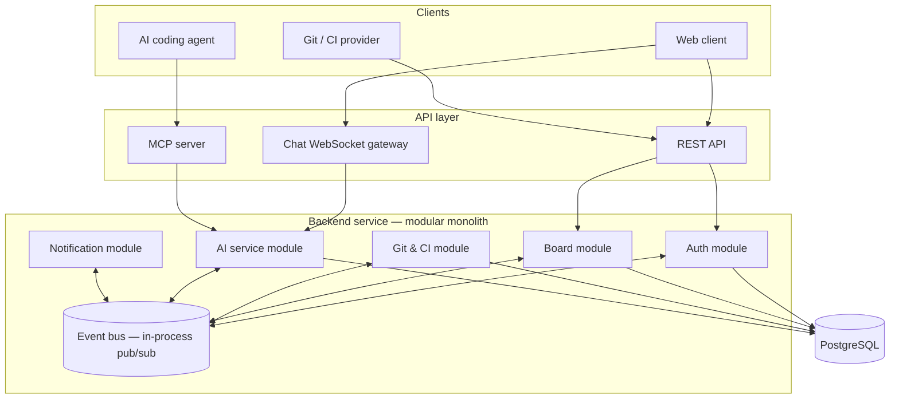

# DevFlow — Architecture

> Companion to `PRODUCT_SPEC.md`. Read that first for *what* and *why*; this document covers *how* the system is structured.
>
> **Status:** Architecture style, module boundaries, and tech stack are decided (see Section 9).

---

## 1. Architecture style & rationale

**Decision: modular monolith.** One codebase, one deployable backend service, internally split into modules with strict boundaries — not a distributed microservices system.

**Why, given the constraints (2-person team, one semester, must ship a real, working, deployable product):**

| Option | Operational cost | Risk if time runs short | Verdict |
|---|---|---|---|
| Modular monolith | Low — one deploy pipeline, one database, no inter-service network | Low — cut scope inside a module, other modules unaffected | **Chosen** |
| Real microservices | High — N deploy pipelines, service discovery, distributed failure modes | High — one unfinished service can block everything that depends on it | Rejected for this project's scope |

The priority for this project is **shipping a working, real, deployable product**, not maximizing the number of independently deployed services. A modular monolith still demonstrates service-oriented thinking — clear module boundaries, explicit communication contracts, and a documented path to extraction — without taking on distributed-systems risk that two people can't absorb in one semester.

**What makes this still "service-oriented" rather than a plain monolith:** modules never call each other's internals directly. All cross-module communication goes through an **in-process event bus**. This is the seam along which any module could later be extracted into a standalone service without the other modules changing — see [Section 8](#8-scaling-path--extracting-a-module).

## 2. Module map

All three client types (web app, AI coding agent, Git/CI provider) enter through the API layer. No client and no module reaches into another module's internals — everything crosses the event bus.

## 3. Module responsibilities

| Module | Owns | Does not own |
|---|---|---|
| **Auth** | Accounts, workspaces, membership, permissions | Task/board data |
| **Board** | Boards, lists, cards/tasks, assignees, due dates, comments, activity history | Git/CI data, AI logic |
| **Git & CI** | Git webhook ingestion, commit/PR → task linking, CI log ingestion | Task display logic, AI summarization |
| **AI service** | Task breakdown from text, conversational Q&A, CI/CD failure summarization — the single shared brain behind both the chat UI and the MCP server | Direct database writes to Board (it requests changes via events, it doesn't own Board's data) |
| **Notification** | Notification delivery (in-app, push), deadline risk alerts | Deciding *what* counts as risky — that logic lives in AI service or Board, Notification only delivers |

**Why AI service is one module, not split by feature:** task breakdown, Q&A, and CI summarization all sit on the same underlying capability (an LLM reasoning over project context) and are consumed by two different client types (chat UI, MCP server) that must never diverge in behavior. Splitting it would risk duplicated logic between the two access paths — see `PRODUCT_SPEC.md` Section 9.

## 4. Communication contract — event bus

Modules publish and subscribe to typed events. This table is the contract; treat it as the source of truth when implementing a module that reacts to another module's state.

| Event | Published by | Consumed by | Payload (conceptual) |
|---|---|---|---|
| `task.created` | Board | AI service, Notification | task id, project id, description |
| `task.status_changed` | Board, Git & CI | Notification, AI service | task id, old status, new status, cause (manual / git) |
| `git.commit_linked` | Git & CI | Board | task id, commit sha, repo, author |
| `git.pr_opened` / `git.pr_merged` | Git & CI | Board, Notification | task id, PR url, repo |
| `ci.failure_detected` | Git & CI | AI service | pipeline id, raw log reference, repo, commit sha |
| `ci.failure_summarized` | AI service | Board, Notification | pipeline id, summary text, related task id (if resolved) |
| `risk.deadline_flagged` | AI service | Notification | task id or sprint id, reason, severity |

**Rule:** a module may only read another module's data by subscribing to its events (or, for synchronous needs, calling a narrow public interface function — never importing internal models/repositories across module folders).

## 5. API layer

Three access paths, all backed by the same underlying modules — no duplicated business logic per client type:

- **REST API** — CRUD for boards/tasks/auth, consumed by the web client.
- **Chat WebSocket gateway** — real-time chat + live board sync, consumed by the web client's chat box. Calls into AI service the same way MCP does.
- **MCP server** — thin adapter exposing AI service's query/analysis capabilities (project Q&A, CI failure lookup) to AI coding agents (Cursor, Claude Code). Implements the same underlying function calls as the chat gateway; it does not reimplement AI logic.

## 6. Data layer

Single shared PostgreSQL database for the MVP. Each module owns its own tables conceptually (e.g. Board owns `tasks`, `boards`; Auth owns `users`, `workspaces`) even though they live in one physical database — this keeps the eventual "split the database per service" step (if ever needed) mechanical rather than a redesign.

## 7. Deployment & infrastructure

- **Local / dev:** Docker Compose — backend, frontend, PostgreSQL, Prometheus, Grafana as services in one `docker-compose.yml`.
- **Production:** deploy the single backend service + frontend to a simple PaaS (e.g. Render, Railway, Fly.io) with a managed PostgreSQL add-on. This satisfies the course requirement of a real, deployable, publicly reachable application without taking on Kubernetes-level operational overhead that a modular monolith doesn't need.
- **Observability:** Prometheus + Grafana run as an ordinary Compose service scraping the backend's metrics endpoint — no Kubernetes dependency required for monitoring.

Kubernetes was considered (the team already has hands-on experience with it) but intentionally not used here: Kubernetes exists to orchestrate *many independently scaled services*, and applying it to a single modular monolith adds operational surface area without a corresponding benefit for this project's scope.

## 8. Scaling path — extracting a module

This is the concrete argument for "designed to scale" — worth having ready for defense/demo. Example: extracting **AI service** into a standalone service once load justifies it.

1. AI service already only communicates via the event bus and a narrow public interface — no other module imports its internals.
2. Replace the in-process event bus implementation with a real message broker (e.g. RabbitMQ or Kafka) for the events AI service publishes/subscribes to. Other modules' code does not change — they still just publish/subscribe to the same event names.
3. Move the AI service module's code into its own deployable unit, pointed at the broker instead of the in-process bus.
4. The API layer's calls into AI service (from the chat gateway and MCP server) switch from an in-process function call to an HTTP/RPC call — this is the only integration point that changes.

Because the module never had a direct dependency on another module's internals, this extraction touches the event bus wiring and the API layer's call site — not the business logic of Board, Auth, or Notification.

## 9. Tech stack

**Backend language: Java.** Chosen deliberately over the earlier Node.js draft — the team is standardizing on Java/Spring for career-relevant SWE experience. This does not change the architecture in Section 1–8: Spring Boot fits the modular-monolith style well (module boundaries via package structure + dependency injection, in-process pub/sub via `ApplicationEventPublisher`).

| Concern | Choice | Why |
|---|---|---|
| Backend framework | **Spring Boot 3.x** | Industry-standard Java backend; one framework covers REST, WebSocket, DI, security, observability |
| Database | PostgreSQL, via **Spring Data JPA** (Hibernate) | Already familiar to the team |
| REST API | Spring Web (MVC) | Built into Spring Boot |
| Chat WebSocket | Spring WebSocket (STOMP or raw) | Built into Spring Boot, no extra dependency |
| In-process event bus | Spring `ApplicationEventPublisher` / `@EventListener` | Built-in Spring pub/sub — matches the in-process event bus design in Section 4 exactly; swappable for a real broker per Section 8 without changing publisher/subscriber code |
| MCP server | Official MCP Java SDK (`modelcontextprotocol/java-sdk`, GA 2.0.0, built with Spring AI) via **Spring AI MCP Server Starter** | Official SDK, drops directly into Spring Boot |
| LLM calls (AI service module) | **Spring AI** | Same ecosystem as the MCP starter; provider-agnostic interface |
| Auth | **Spring Security** | Standard for Spring apps; keeps auth logic inside the Auth module, not delegated to a third party (see Section 9.1) |
| Frontend | **React + TypeScript + Vite**, TailwindCSS | Team already knows React/Tailwind (see `PRODUCT_SPEC.md` origin). Vite, not Next.js — DevFlow is an authenticated internal tool with no SEO/SSR need, so a plain SPA build is simpler and avoids framework overhead Next.js exists for |
| Local/dev infra | Docker Compose | Matches Section 7 |
| Production hosting | Render / Railway / Fly.io (pick one) | Simple git-push deploy, managed Postgres available |
| Monitoring | Prometheus + Grafana, via **Spring Boot Actuator + Micrometer** | Actuator exposes a Prometheus-format metrics endpoint with minimal setup |
| DNS / CDN / frontend hosting | **Cloudflare** (DNS + proxy in front of the domain, Cloudflare Pages for the frontend build) | Low effort, free tier: HTTPS, basic DDoS protection, fast static hosting — makes the deployed app closer to production-grade for minimal cost |

### 9.1 Third parties considered and rejected

- **Supabase — not used.** Supabase bundles hosted Postgres, Auth, and Realtime, aimed at apps that call it directly from the frontend. This project already owns Auth as a Spring Security-backed module and Postgres via the PaaS's managed database — adding Supabase Auth would create a second, competing auth system and break the "each module owns its own concern" boundary from Section 3.
- **Redis — deferred, not part of the MVP.** No concrete problem in the current scope requires it. Add it later only if a specific need appears — e.g. caching repeated CI/CD failure summaries to avoid redundant LLM calls, or rate-limiting AI requests per user. Adding it without one of those concrete needs would be infrastructure for its own sake.

## 10. Notes for AI coding agents

- Respect module boundaries strictly: never write code in one module folder that imports another module's internal files (models, repositories, services) directly. Cross-module interaction goes through the event bus or an explicitly exported public interface function.
- When adding a new cross-module interaction, first check [Section 4](#4-communication-contract--event-bus) for an existing event that fits. If none fits, propose a new event following the same naming pattern (`domain.event_past_tense`) rather than reaching into another module directly.
- The AI service module is the single implementation behind both the chat gateway and the MCP server — when adding a capability to one, check whether it belongs in AI service so both access paths get it, rather than implementing it twice.
- Do not introduce Kubernetes, a message broker, or additional deployable services unless explicitly asked — the current architecture is deliberately a single deployable unit (see Section 7).
- The backend is Java/Spring Boot, not Node.js — do not generate Node/Express code for the backend even if earlier context or training data defaults there.
- Do not add Supabase or Redis unless explicitly asked — see Section 9.1 for why they were deliberately left out.
