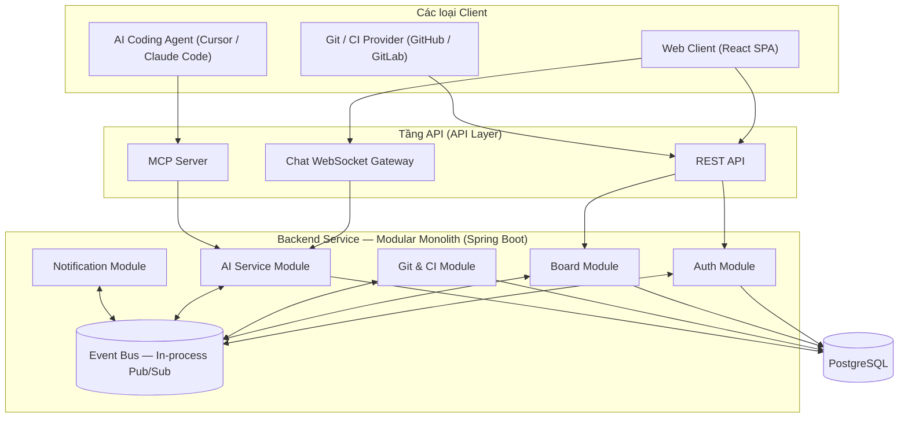

# DevFlow — Tài liệu Kiến trúc Hệ thống (Architecture)

> 🌐 **Ngôn ngữ:** **Tiếng Việt** (Dành cho Developer đọc & theo dõi) | [English Version (Best Practices for AI Agents)](file:///c:/Users/Tien/university/ServiceOrientedProgramDesign/DevFlow/docs/ARCHITECTURE.md)
>
> Tài liệu bổ trợ cho `PRODUCT_SPEC_VI.md` / `PRODUCT_SPEC.md`. Đọc tài liệu đó trước để hiểu sản phẩm làm *cái gì* và *tại sao*; tài liệu này tập trung vào *cách thức* hệ thống được cấu trúc.
>
> **Trạng thái:** Phong cách kiến trúc, ranh giới module và tech stack đã được quyết định chính thức (xem Mục 9).

---

## 1. Phong cách Kiến trúc & Lý do Lựa chọn

**Quyết định: Modular Monolith (Monolith theo khối module).** Một codebase duy nhất, một backend service duy nhất có thể deploy độc lập, nhưng bên trong được chia thành các module có ranh giới nghiêm ngặt — không phải một hệ thống microservices phân tán.

**Lý do lựa chọn, dựa trên các ràng buộc thực tế (Nhóm 2 người, thời gian 1 học kỳ, mục tiêu bắt buộc phải ship được sản phẩm thực tế, chạy và deploy hoàn chỉnh):**

| Phương án | Chi phí vận hành | Rủi ro nếu thiếu thời gian | Kết luận |
|---|---|---|---|
| **Modular Monolith** | **Thấp** — 1 pipeline deploy, 1 database chung, không có network overhead giữa các service | **Thấp** — có thể cắt giảm scope bên trong một module mà không làm ảnh hưởng module khác | **Được chọn** |
| **Microservices phân tán** | **Cao** — N pipeline deploy, service discovery, distributed tracing, network failure modes | **Cao** — 1 service chưa xong có thể làm nghẽn toàn bộ hệ thống | Loại bỏ đối với phạm vi đồ án này |

Ưu tiên số một của dự án này là **bàn giao một sản phẩm hoạt động thực tế, có thể deploy và truy cập công khai**, chứ không phải tối đa hóa số lượng microservices được deploy riêng lẻ. Một kiến trúc Modular Monolith vẫn thể hiện đầy đủ tư duy hướng dịch vụ (**Service-Oriented Thinking**) — ranh giới module rõ ràng, hợp đồng giao tiếp tường minh, và có lộ trình bóc tách rõ ràng — mà không phải gánh chịu rủi ro phức tạp của hệ thống phân tán mà 2 người khó có thể kiểm soát trong 1 học kỳ.

**Điểm cốt lõi khiến hệ thống này mang tính "Hướng dịch vụ" thay vì là một Monolith thông thường:** Các module **tuyệt đối không bao giờ gọi trực tiếp vào code nội bộ của nhau**. Toàn bộ giao tiếp liên module đều đi qua một **In-Process Event Bus** (hàng đợi sự kiện nội bộ). Đây chính là ranh giới kỹ thuật giúp bất kỳ module nào sau này cũng có thể dễ dàng được bóc tách thành một microservice độc lập mà không cần sửa code của các module còn lại — xem [Mục 8](#8-lộ-trình-mở-rộng--bóc-tách-module).

---

## 2. Bản đồ Module (Module Map)

Cả 3 nhóm client (Web App, AI Coding Agent, Git/CI Provider) đều đi qua tầng API. Không một client và không một module nào được phép chọc thẳng vào dữ liệu nội bộ của module khác — mọi dữ liệu xuyên biên giới đều phải đi qua Event Bus.

---

## 3. Trách nhiệm của Từng Module

| Module | Sở hữu & Quản lý | Tuyệt đối KHÔNG sở hữu |
|---|---|---|
| **Auth** | Tài khoản, Workspace, Quyền thành viên, Phân quyền bảo mật | Dữ liệu Task / Board |
| **Board** | Board, Cột trạng thái, Card/Task, Assignee, Hạn chót, Comment, Lịch sử thao tác | Dữ liệu Git/CI, Logic phân tích AI |
| **Git & CI** | Tiếp nhận Webhook Git, liên kết Commit/PR với Task, Tiếp nhận log lỗi CI | Giao diện hiển thị Task, Logic tóm tắt AI |
| **AI Service** | Phân rã task từ mô tả, Hỏi đáp dự án tự nhiên, Tóm tắt lỗi CI/CD — là "bộ não chung" duy nhất cho cả Chat UI và MCP Server | Ghi trực tiếp vào DB của Board (AI chỉ yêu cầu thay đổi qua Domain Events, không sở hữu bảng của Board) |
| **Notification** | Chuyển phát thông báo (In-app, Push), Cảnh báo rủi ro deadline | Quyết định *thế nào là rủi ro* — logic đó thuộc về AI Service hoặc Board; Notification chỉ làm nhiệm vụ gửi |

**Tại sao AI Service là 1 module duy nhất mà không tách rời theo từng tính năng:** Việc phân rã task, hỏi đáp Q&A và tóm tắt CI đều dựa trên cùng một năng lực nền tảng (LLM suy luận trên ngữ cảnh dự án) và được tiêu thụ bởi 2 client khác nhau (Chat UI và MCP Server). Việc chia nhỏ sẽ dẫn tới trùng lặp logic prompt và xử lý giữa 2 kênh truy cập — xem `PRODUCT_SPEC_VI.md` Mục 9.

---

## 4. Hợp đồng Giao tiếp — Event Bus (Domain Events)

Các module xuất bản (publish) và đăng ký nhận (subscribe) các sự kiện có kiểu rõ ràng (`record` implements `DevFlowEvent`). Bảng dưới đây là hợp đồng chuẩn mực:

| Tên Event | Xuất bản bởi | Nhận bởi | Dữ liệu Payload (Khái niệm) |
|---|---|---|---|
| `task.created` | Board | AI Service, Notification | task id, project id, description |
| `task.status_changed` | Board, Git & CI | Notification, AI Service | task id, old status, new status, cause (manual / git) |
| `git.commit_linked` | Git & CI | Board | task id, commit sha, repo, author |
| `git.pr_opened` / `git.pr_merged` | Git & CI | Board, Notification | task id, PR url, repo |
| `ci.failure_detected` | Git & CI | AI Service | pipeline id, raw log reference, repo, commit sha |
| `ci.failure_summarized` | AI Service | Board, Notification | pipeline id, summary text, related task id (if resolved) |
| `risk.deadline_flagged` | AI Service | Notification | task id or sprint id, reason, severity |

**Quy tắc:** Một module chỉ được đọc dữ liệu của module khác bằng cách đăng ký nhận Event của nó (hoặc đối với các nhu cầu đồng bộ tức thời, gọi qua một hàm hẹp trên Public API Interface `-api` — tuyệt đối không bao giờ import Model hay Repository nội bộ giữa các thư mục module).

---

## 5. Tầng API (API Layer)

Hệ thống cung cấp 3 cổng truy cập, tất cả đều được hỗ trợ bởi cùng một hệ thống module nền tảng bên dưới — không trùng lặp logic nghiệp vụ:

- **REST API:** Thực hiện các thao tác CRUD cho Board, Task, Auth — phục vụ Web Client.
- **Chat WebSocket Gateway:** Kênh trao đổi thời gian thực cho tính năng Chat Assistant + đồng bộ bảng Kanban trực tiếp — phục vụ hộp chat trên Web Client. Gọi vào AI Service tương tự như MCP.
- **MCP Server (Model Context Protocol):** Adapter giao tiếp nhẹ xuất bản năng lực phân tích của AI Service (hỏi đáp dự án, tra cứu lỗi CI) cho các AI Coding Agent trong IDE (Cursor, Claude Code). Sử dụng chung các hàm nội bộ của AI Service như Chat Gateway.

---

## 6. Tầng Dữ liệu (Data Layer)

Một cơ sở dữ liệu **PostgreSQL** dùng chung duy nhất cho MVP. Tuy nhiên, về mặt khái niệm, mỗi module sở hữu độc quyền tập bảng của riêng mình (ví dụ: Board sở hữu bảng `tasks`, `boards`; Auth sở hữu `users`, `workspaces`). Việc phân chia rõ quyền sở hữu bảng giúp quá trình tách database riêng cho từng microservice (nếu cần sau này) diễn ra hoàn toàn cơ học mà không cần đập đi thiết kế lại.

---

## 7. Hạ tầng & Triển khai (Deployment & Infra)

- **Môi trường Local / Dev:** Sử dụng **Docker Compose** — chạy đồng thời backend, frontend, PostgreSQL, Prometheus, Grafana trong một file `docker-compose.yml`.
- **Môi trường Production:** Deploy backend service + frontend lên các nền tảng PaaS tinh gọn (như Render, Railway, hoặc Fly.io) đi kèm PostgreSQL managed addon. Điều này thỏa mãn yêu cầu của môn học về một ứng dụng thực tế có thể truy cập từ Internet mà không phát sinh chi phí vận hành phức tạp của Kubernetes.
- **Khả năng Giám sát (Observability):** Prometheus + Grafana chạy như các service Compose thông thường, scrape dữ liệu trực tiếp từ endpoint Actuator của Spring Boot.

*Ghi chú về Kubernetes:* Nhóm đã có kinh nghiệm thực tế với K8s nhưng chủ động không sử dụng ở đồ án này. Kubernetes sinh ra để điều phối *nhiều microservices độc lập cần scale riêng biệt*, việc áp dụng K8s cho một hệ thống Modular Monolith chỉ làm tăng diện tích vận hành mà không mang lại lợi ích tương xứng cho đồ án 1 học kỳ.

---

## 8. Lộ trình Mở rộng — Bóc tách Module (Extracting a Module)

Đây là luận điểm kỹ thuật quan trọng minh chứng cho tính "Thiết kế có khả năng mở rộng" (Designed to Scale) khi bảo vệ đồ án. Ví dụ: Bóc tách **AI Service** thành một microservice độc lập khi tải tăng cao:

1. AI Service vốn dĩ chỉ giao tiếp qua Event Bus và Public Interface hẹp — không có bất kỳ module nào chọc trực tiếp vào code nội bộ của nó.
2. Thay thế `ApplicationEventPublisher` (In-process bus) bằng một Message Broker thực thụ (như RabbitMQ hoặc Kafka) cho các sự kiện mà AI Service lắng nghe và phát ra. Code nghiệp vụ của các module khác hoàn toàn không phải sửa đổi.
3. Chuyển source code của module `ai-impl` thành một project deploy riêng, trỏ tới Message Broker thay vì in-process bus.
4. Tầng API (Chat Gateway và MCP Server) chuyển lời gọi từ in-process Java method call sang REST / gRPC call — đây là điểm thay đổi duy nhất.

Vì module chưa từng phụ thuộc trực tiếp vào ruột của module khác, việc bóc tách này chỉ tác động tới cấu hình Event Bus và Adapter ở API Layer, không làm ảnh hưởng tới logic nghiệp vụ của Board, Auth, hay Notification.

---

## 9. Công nghệ Lựa chọn (Tech Stack)

**Ngôn ngữ Backend: Java.** Lựa chọn có chủ đích để chuẩn hóa kiến thức thực tập/công việc chuyên nghiệp với Java/Spring. Spring Boot 3.x hoàn toàn phù hợp với mô hình Modular Monolith (phân tách ranh giới bằng Gradle Subprojects + Dependency Injection, In-process Pub/Sub bằng `ApplicationEventPublisher`).

| Thành phần | Lựa chọn | Lý do |
|---|---|---|
| Backend Framework | **Spring Boot 3.4.x** | Tiêu chuẩn công nghiệp cho Java backend; gom chung REST, WebSocket, DI, Security, Observability trong 1 framework |
| Database | PostgreSQL qua **Spring Data JPA** (Hibernate) | Thân thuộc, mạnh mẽ, quan hệ dữ liệu chuẩn |
| REST API | Spring Web (MVC) | Tích hợp sẵn trong Spring Boot |
| Chat WebSocket | Spring WebSocket (STOMP) | Tích hợp sẵn, đơn giản, hỗ trợ pub/sub topic dễ dàng |
| In-Process Event Bus | Spring `ApplicationEventPublisher` / `@EventListener` | Tích hợp sẵn, đúng chuẩn Event-driven nội bộ, dễ thay thế bằng RabbitMQ/Kafka sau này |
| MCP Server | Spring AI MCP Server Starter (`modelcontextprotocol/java-sdk`) | SDK MCP Java chính thức, tích hợp tự nhiên vào Spring Boot |
| Tương tác LLM (AI Module) | **Spring AI** | Nằm trong hệ sinh thái Spring, hỗ trợ đa nhà cung cấp (OpenAI, Gemini...), linh hoạt |
| Xác thực & Phân quyền | **Spring Security** (Stateless JWT) | Giữ quyền kiểm soát logic Auth bên trong hệ thống thay vì phụ thuộc dịch vụ ngoài |
| Frontend | **React + TypeScript + Vite**, TailwindCSS v4 | Hiện đại, nhanh nhẹn, SPA chuẩn mực cho dashboard nội bộ |
| Hạ tầng Local | Docker Compose | Chạy đồng bộ toàn bộ stack chỉ với 1 lệnh |
| Hosting Production | Render / Railway / Fly.io | Deploy tiện lợi qua Git, tích hợp sẵn Postgres managed |
| Giám sát | Prometheus + Grafana qua **Spring Boot Actuator + Micrometer** | Actuator xuất metrics định dạng Prometheus sẵn sàng với cấu hình tối thiểu |
| CDN & Frontend Hosting | **Cloudflare Pages** | Miễn phí, tốc độ cao, hỗ trợ SSL tự động và chống DDoS cơ bản |

### 9.1 Các công nghệ được cân nhắc nhưng chủ động loại bỏ

- **Supabase — Không sử dụng.** Supabase hướng tới việc gọi trực tiếp từ client vào DB/Auth bên ngoài. DevFlow đã tự sở hữu module Auth bằng Spring Security và database Postgres riêng. Việc nhồi thêm Supabase sẽ tạo ra 2 hệ thống Auth song song và phá vỡ ranh giới module.
- **Redis — Tạm hoãn, không nằm trong MVP.** Hiện chưa có bài toán cụ thể nào bắt buộc phải dùng Redis trong giai đoạn đầu. Sẽ chỉ bổ sung khi thực sự cần (ví dụ: cache kết quả tóm tắt CI failure để tiết kiệm chi phí gọi LLM, hoặc rate-limiting AI request). Thêm Redis quá sớm chỉ làm phình hạ tầng không cần thiết.

---

## 10. Nguyên tắc Dành cho Lập trình viên & AI Coding Agents

- **Tôn trọng ranh giới module tuyệt đối:** Không bao giờ viết code trong một module mà import trực tiếp các class nội bộ (Entities, Repositories, Services) từ module khác. Mọi tương tác liên module phải qua Event Bus hoặc API Interface công khai (`-api`).
- **Khi cần tương tác mới giữa 2 module:** Kiểm tra trước tại [Mục 4](#4-hợp-đồng-giao-tiếp--event-bus-domain-events) xem có Event nào phù hợp không. Nếu chưa có, tạo Event mới theo quy ước đặt tên `domain.event_past_tense`.
- **Module AI Service là bản cài đặt duy nhất:** Cả Chat Gateway lẫn MCP Server đều dùng chung logic này — khi thêm tính năng mới, hãy thêm vào AI Service để cả 2 kênh đều được hưởng lợi.
- **Không tự ý thêm Kubernetes, Message Broker, hay Redis** trừ khi có yêu cầu cụ thể từ người phụ trách.
- **Backend bắt buộc viết bằng Java/Spring Boot**, không dùng Node/Express.
