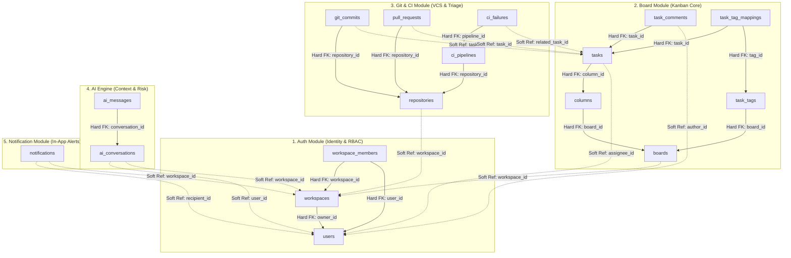

# System Database Architecture & ERD Specification — DevFlow

> **Project:** DevFlow — Intelligent Developer Coordination Platform for Software Teams  
> **Course:** Service-Oriented Program Design  
> **Architecture:** Modular Monolith (Java 17, Spring Boot 3.4.5, PostgreSQL 17)  
> **Version:** 1.0.0 (Milestone M1)  
> **Cross-Reference:** [docs/DATABASE_DESIGN_VI.md](file:///docs/DATABASE_DESIGN_VI.md) (Vietnamese version) | [docs/ARCHITECTURE.md](file:///docs/ARCHITECTURE.md)

---

## 1. Architectural Overview & Service-Oriented Principles

### 1.1. Context & Design Objectives
**DevFlow** integrates 5 core functional domains:
1. **Auth & Identity:** Manages user credentials, authentication sessions, project workspaces, and role-based access control (RBAC).
2. **Board & Task Management:** Manages visual Kanban workflows, progress columns, tasks, comments, and tagging taxonomy.
3. **Git & CI/CD Integration:** Tracks version control systems (GitHub/GitLab), commits, pull requests, webhook events, and CI/CD pipeline failure logs.
4. **AI Engine:** Contextual assistant providing automated root-cause failure analysis, sprint risk assessments, and interactive developer queries.
5. **Notification:** Real-time in-app notification pipeline (supporting WebSocket push and REST query history).

To optimize operational overhead and maintain lean infrastructure during the MVP phase, DevFlow runs on a single shared **PostgreSQL 17** database. However, in terms of logical data modeling, DevFlow strictly enforces the **Logical Database-per-Module** pattern:
- Every business module exclusively owns its tables.
- Cross-module physical foreign keys (`FOREIGN KEY ... REFERENCES`) are strictly forbidden.
- All inter-module relationships are normalized into **Soft References via UUID** coupled with **Public API Interfaces** and **Domain Event Bus** for data synchronization.

---

### 1.2. In-Depth Analysis: Hard Foreign Keys vs Soft Reference UUIDs

In traditional monolith applications, engineers often rely on database-level hard foreign keys for all entity associations. From a **Service-Oriented Architecture (SOA)** perspective, this introduces tight database coupling, preventing any future extraction into independent microservices.

```
[Server 1 — PostgreSQL Instance A]          [Server 2 — PostgreSQL Instance B]
        Module Auth                                  Module Board
       ┌───────────┐                                ┌───────────┐
       │   users   │                                │   tasks   │
       │ (id: u1)  │ < - - - - - - - - - - - - - -  │(assignee) │
       └───────────┘         IMPOSSIBLE!            └───────────┘
                 RDBMS CANNOT ENFORCE FOREIGN KEYS
                   ACROSS NETWORKS (HTTP / RPC)
```

#### A. Under the Hood of the RDBMS Engine:
1. **Data Insertion / Updates (`INSERT / UPDATE` on Child Table):**
   - **Soft Reference (`UUID`):** PostgreSQL writes 16 bytes directly into the table data page and updates the index. Execution completes in microseconds with zero dependency on the parent table.
   - **Hard Foreign Key (`REFERENCES`):** The RDBMS engine suspends the write operation, triggers an internal index lookup on the parent table, and acquires a **Shared Lock (`FOR KEY SHARE`)** on the parent row. Under high concurrency, this creates lock contention and degrades write throughput.
2. **Parent Record Deletion / Modification (`DELETE / UPDATE`):**
   - **Soft Reference:** The parent row is deleted immediately. Child tables experience zero locking and zero index scans.
   - **Hard Foreign Key (`CASCADE / RESTRICT`):** The engine scans the child table. Under `CASCADE`, extensive `Row-Exclusive Locks` are acquired on child rows, creating severe **Deadlock Risks** when multiple developers are modifying board tasks concurrently.
3. **Encapsulation Breakdown with ORMs (Hibernate / JPA):**
   - Physical foreign keys encourage developers to define `@ManyToOne private UserEntity assignee;` inside `TaskEntity`.
   - Consequence: The Board module can directly access `task.getAssignee().getPasswordHash()`, violating data encapsulation and security boundaries.

---

### 1.3. Foreign Key Strategy Matrix

| Criteria | Soft Reference (UUID) | Hard Foreign Key (`REFERENCES`) |
|---|---|---|
| **Nature** | **Passive Data (16-byte value)** | **Active Constraint Enforcement + Internal Locks** |
| **Storage Overhead** | 16 bytes (UUID) | 16 bytes (UUID) + `pg_constraint` catalog entry |
| **Write Performance** | Maximum; independent writes | Slower; requires parent lookup + `FOR KEY SHARE` |
| **Deadlock Risk** | None; transactions are decoupled | High under concurrent write workloads |
| **Microservice Readiness**| 100% extractable to a separate database | Impossible without rewriting schema and application logic |
| **DevFlow Application** | **Inter-module relationships** | **Intra-module relationships (internal only)** |
| **Integrity Mechanism** | **Public API + Domain Events (Eventual Consistency)** | **RDBMS ACID Engine** |

---

## 2. System Entity-Relationship Diagram (ERD)

The complete DevFlow platform comprises **16 tables** distributed across the 5 modules:

### 2.1. High-Level Domain Boundary Diagram

The diagram below highlights module data ownership and soft UUID reference links across service boundaries:



---

### 2.2. Detailed Schema & Attributes (Mermaid Code)
The complete Mermaid ERD source code with all attributes, data types, indexes, and constraints is maintained at:  
👉 **[docs/diagrams/database-erd.mmd](file:///docs/diagrams/database-erd.mmd)**

---

## 3. Comprehensive Data Dictionary (16 Tables Across 5 Modules)

### 3.1. Module 1: Auth & Identity (`auth`)

#### Table `users`
Stores user accounts, credentials, and profile information.

| Column Name | Data Type | Attributes | Description & Constraints |
|---|---|---|---|
| `id` | `UUID` | PK, NOT NULL, DEFAULT `gen_random_uuid()` | Unique user identifier |
| `email` | `VARCHAR(255)` | UK, NOT NULL | Unique login email (`uq_users_email`) |
| `password_hash`| `VARCHAR(255)` | NOT NULL | BCrypt hashed password (`$2a$10$...`) |
| `full_name` | `VARCHAR(255)` | NOT NULL | User's full display name |
| `avatar_url` | `VARCHAR(512)` | NULL | Avatar URL hosted on CDN or Gravatar |
| `created_at` | `TIMESTAMPTZ` | NOT NULL, DEFAULT `CURRENT_TIMESTAMP` | Account creation timestamp |
| `updated_at` | `TIMESTAMPTZ` | NOT NULL, DEFAULT `CURRENT_TIMESTAMP` | Last profile update timestamp |

- **Indexes:** `idx_users_email` on `(email)` (B-Tree, fast login lookup).

---

#### Table `workspaces`
Project spaces and organizational boundaries.

| Column Name | Data Type | Attributes | Description & Constraints |
|---|---|---|---|
| `id` | `UUID` | PK, NOT NULL, DEFAULT `gen_random_uuid()` | Unique workspace identifier |
| `name` | `VARCHAR(255)` | NOT NULL | Display name (e.g. "DevFlow Core Team") |
| `slug` | `VARCHAR(100)` | UK, NOT NULL | Unique URL slug (`uq_workspaces_slug`, e.g. `devflow-core`) |
| `owner_id` | `UUID` | FK, NOT NULL | Internal FK referencing `users(id)` ON DELETE RESTRICT |
| `created_at` | `TIMESTAMPTZ` | NOT NULL, DEFAULT `CURRENT_TIMESTAMP` | Workspace creation timestamp |
| `updated_at` | `TIMESTAMPTZ` | NOT NULL, DEFAULT `CURRENT_TIMESTAMP` | Last modification timestamp |

- **Indexes:**
  - `idx_workspaces_slug` on `(slug)`.
  - `idx_workspaces_owner_id` on `(owner_id)`.

---

#### Table `workspace_members`
Association table managing workspace memberships and assigned roles.

| Column Name | Data Type | Attributes | Description & Constraints |
|---|---|---|---|
| `id` | `UUID` | PK, NOT NULL, DEFAULT `gen_random_uuid()` | Membership record ID |
| `workspace_id`| `UUID` | FK, NOT NULL | Internal FK referencing `workspaces(id)` ON DELETE CASCADE |
| `user_id` | `UUID` | FK, NOT NULL | Internal FK referencing `users(id)` ON DELETE CASCADE |
| `role` | `VARCHAR(50)` | NOT NULL, DEFAULT `'MEMBER'` | Role: `OWNER`, `ADMIN`, `MEMBER` |
| `created_at` | `TIMESTAMPTZ` | NOT NULL, DEFAULT `CURRENT_TIMESTAMP` | Timestamp when user joined |
| `updated_at` | `TIMESTAMPTZ` | NOT NULL, DEFAULT `CURRENT_TIMESTAMP` | Role modification timestamp |

- **Constraints:** `uq_workspace_member UNIQUE (workspace_id, user_id)`.
- **Indexes:**
  - `idx_workspace_members_workspace` on `(workspace_id)`.
  - `idx_workspace_members_user` on `(user_id)`.

---

### 3.2. Module 2: Board & Task Management (`board`)

#### Table `boards`
Kanban boards owned by a workspace.

| Column Name | Data Type | Attributes | Description & Constraints |
|---|---|---|---|
| `id` | `UUID` | PK, NOT NULL, DEFAULT `gen_random_uuid()` | Board identifier |
| `workspace_id`| `UUID` | NOT NULL | **Soft Reference** pointing to `workspaces.id` (Auth) |
| `name` | `VARCHAR(255)` | NOT NULL | Board name (e.g. "Sprint 1 — Core Features") |
| `description` | `TEXT` | NULL | Board purpose and objectives |
| `is_archived` | `BOOLEAN` | NOT NULL, DEFAULT `FALSE` | Soft archive flag |
| `created_at` | `TIMESTAMPTZ` | NOT NULL, DEFAULT `CURRENT_TIMESTAMP` | Creation timestamp |
| `updated_at` | `TIMESTAMPTZ` | NOT NULL, DEFAULT `CURRENT_TIMESTAMP` | Last update timestamp |

- **Indexes:** `idx_boards_workspace` on `(workspace_id)`.

---

#### Table `columns`
Workflow status columns within a Kanban board.

| Column Name | Data Type | Attributes | Description & Constraints |
|---|---|---|---|
| `id` | `UUID` | PK, NOT NULL, DEFAULT `gen_random_uuid()` | Column identifier |
| `board_id` | `UUID` | FK, NOT NULL | Internal FK referencing `boards(id)` ON DELETE CASCADE |
| `name` | `VARCHAR(100)` | NOT NULL | Column name (e.g. "To Do", "In Progress") |
| `position` | `INT` | NOT NULL | Order index from left to right (0-indexed) |
| `status_category`| `VARCHAR(50)`| NOT NULL | Status bucket: `TODO`, `IN_PROGRESS`, `IN_REVIEW`, `DONE` |
| `created_at` | `TIMESTAMPTZ` | NOT NULL, DEFAULT `CURRENT_TIMESTAMP` | Creation timestamp |
| `updated_at` | `TIMESTAMPTZ` | NOT NULL, DEFAULT `CURRENT_TIMESTAMP` | Last modification timestamp |

- **Indexes:** `idx_columns_board_position` on `(board_id, position)`.

---

#### Table `tasks`
Work items / tickets managed within Kanban columns.

| Column Name | Data Type | Attributes | Description & Constraints |
|---|---|---|---|
| `id` | `UUID` | PK, NOT NULL, DEFAULT `gen_random_uuid()` | Task identifier |
| `column_id` | `UUID` | FK, NOT NULL | Internal FK referencing `columns(id)` ON DELETE CASCADE |
| `title` | `VARCHAR(255)` | NOT NULL | Concise task title |
| `description` | `TEXT` | NULL | Detailed specifications (Markdown supported) |
| `position` | `INT` | NOT NULL | Order within column for drag-and-drop sorting |
| `priority` | `VARCHAR(50)` | NOT NULL, DEFAULT `'MEDIUM'` | Priority level: `LOW`, `MEDIUM`, `HIGH`, `URGENT` |
| `assignee_id` | `UUID` | NULL | **Soft Reference** pointing to `users.id` (Auth) |
| `due_date` | `TIMESTAMPTZ` | NULL | Target deadline timestamp |
| `created_at` | `TIMESTAMPTZ` | NOT NULL, DEFAULT `CURRENT_TIMESTAMP` | Creation timestamp |
| `updated_at` | `TIMESTAMPTZ` | NOT NULL, DEFAULT `CURRENT_TIMESTAMP` | Last modification timestamp |

- **Indexes:**
  - `idx_tasks_column_position` on `(column_id, position)`.
  - `idx_tasks_assignee` on `(assignee_id)`.
  - `idx_tasks_due_date` on `(due_date)`.

---

#### Table `task_comments`
Discussion threads on individual tasks.

| Column Name | Data Type | Attributes | Description & Constraints |
|---|---|---|---|
| `id` | `UUID` | PK, NOT NULL, DEFAULT `gen_random_uuid()` | Comment identifier |
| `task_id` | `UUID` | FK, NOT NULL | Internal FK referencing `tasks(id)` ON DELETE CASCADE |
| `author_id` | `UUID` | NOT NULL | **Soft Reference** pointing to `users.id` (Auth) |
| `content` | `TEXT` | NOT NULL | Markdown comment text |
| `created_at` | `TIMESTAMPTZ` | NOT NULL, DEFAULT `CURRENT_TIMESTAMP` | Timestamp posted |
| `updated_at` | `TIMESTAMPTZ` | NOT NULL, DEFAULT `CURRENT_TIMESTAMP` | Timestamp edited |

- **Indexes:** `idx_task_comments_task_created` on `(task_id, created_at ASC)`.

---

#### Table `task_tags`
Tag taxonomy managed per board.

| Column Name | Data Type | Attributes | Description & Constraints |
|---|---|---|---|
| `id` | `UUID` | PK, NOT NULL, DEFAULT `gen_random_uuid()` | Tag identifier |
| `board_id` | `UUID` | FK, NOT NULL | Internal FK referencing `boards(id)` ON DELETE CASCADE |
| `name` | `VARCHAR(50)` | NOT NULL | Tag label (e.g. `bug`, `feature`, `backend`) |
| `color` | `VARCHAR(20)` | NOT NULL | Hex color or palette key (e.g. `#EF4444`) |

- **Indexes:** `idx_task_tags_board` on `(board_id)`.

---

#### Table `task_tag_mappings`
Many-to-many link between tasks and tags.

| Column Name | Data Type | Attributes | Description & Constraints |
|---|---|---|---|
| `task_id` | `UUID` | FK, NOT NULL | Internal FK referencing `tasks(id)` ON DELETE CASCADE |
| `tag_id` | `UUID` | FK, NOT NULL | Internal FK referencing `task_tags(id)` ON DELETE CASCADE |

- **Constraints:** `PRIMARY KEY (task_id, tag_id)`.
- **Indexes:** `idx_tag_mappings_tag` on `(tag_id)`.

---

### 3.3. Module 3: Git & CI Integration (`gitci`)

#### Table `repositories`
VCS repositories linked to a workspace.

| Column Name | Data Type | Attributes | Description & Constraints |
|---|---|---|---|
| `id` | `UUID` | PK, NOT NULL, DEFAULT `gen_random_uuid()` | Repository identifier |
| `workspace_id`| `UUID` | NOT NULL | **Soft Reference** pointing to `workspaces.id` (Auth) |
| `provider` | `VARCHAR(50)` | NOT NULL | VCS Provider: `GITHUB`, `GITLAB` |
| `remote_repo_id`| `VARCHAR(100)`| NOT NULL | Remote repository identifier or slug |
| `name` | `VARCHAR(255)` | NOT NULL | Display repository name |
| `webhook_secret`| `VARCHAR(255)`| NOT NULL | Secret key for verifying HMAC webhook signatures |
| `created_at` | `TIMESTAMPTZ` | NOT NULL, DEFAULT `CURRENT_TIMESTAMP` | Creation timestamp |
| `updated_at` | `TIMESTAMPTZ` | NOT NULL, DEFAULT `CURRENT_TIMESTAMP` | Last updated timestamp |

- **Indexes:** `idx_repositories_workspace` on `(workspace_id)`.

---

#### Table `git_commits`
Commit records synced via webhook deliveries.

| Column Name | Data Type | Attributes | Description & Constraints |
|---|---|---|---|
| `id` | `UUID` | PK, NOT NULL, DEFAULT `gen_random_uuid()` | Commit record identifier |
| `repository_id`| `UUID` | FK, NOT NULL | Internal FK referencing `repositories(id)` ON DELETE CASCADE |
| `sha` | `VARCHAR(64)` | UK, NOT NULL | Unique commit SHA hash (`uq_git_commits_sha`) |
| `message` | `TEXT` | NOT NULL | Commit message payload |
| `author_name` | `VARCHAR(255)` | NOT NULL | Author full name |
| `author_email`| `VARCHAR(255)` | NOT NULL | Author email address |
| `task_id` | `UUID` | NULL | **Soft Reference** pointing to `tasks.id` (Board) |
| `committed_at`| `TIMESTAMPTZ` | NOT NULL | Timestamp recorded on developer machine |
| `created_at` | `TIMESTAMPTZ` | NOT NULL, DEFAULT `CURRENT_TIMESTAMP` | Ingestion timestamp |

- **Indexes:**
  - `idx_git_commits_repo` on `(repository_id)`.
  - `idx_git_commits_task_id` on `(task_id)`.

---

#### Table `pull_requests`
Pull request status and review tracking.

| Column Name | Data Type | Attributes | Description & Constraints |
|---|---|---|---|
| `id` | `UUID` | PK, NOT NULL, DEFAULT `gen_random_uuid()` | Pull request identifier |
| `repository_id`| `UUID` | FK, NOT NULL | Internal FK referencing `repositories(id)` ON DELETE CASCADE |
| `pr_number` | `INT` | NOT NULL | Remote PR number (e.g. `#12`) |
| `title` | `VARCHAR(255)` | NOT NULL | PR title |
| `source_branch`| `VARCHAR(255)` | NOT NULL | Head branch name (e.g. `feature/T-002`) |
| `target_branch`| `VARCHAR(255)` | NOT NULL | Base branch name (e.g. `main`) |
| `status` | `VARCHAR(50)` | NOT NULL | Status: `OPEN`, `MERGED`, `CLOSED` |
| `task_id` | `UUID` | NULL | **Soft Reference** pointing to `tasks.id` (Board) |
| `pr_url` | `VARCHAR(512)` | NOT NULL | Direct web link to PR |
| `created_at` | `TIMESTAMPTZ` | NOT NULL, DEFAULT `CURRENT_TIMESTAMP` | Creation timestamp |
| `updated_at` | `TIMESTAMPTZ` | NOT NULL, DEFAULT `CURRENT_TIMESTAMP` | Last status update timestamp |

- **Constraints:** `uq_pr_repo_number UNIQUE (repository_id, pr_number)`.
- **Indexes:**
  - `idx_pull_requests_task_id` on `(task_id)`.
  - `idx_pull_requests_repo_status` on `(repository_id, status)`.

---

#### Table `ci_pipelines`
Continuous integration test suite executions.

| Column Name | Data Type | Attributes | Description & Constraints |
|---|---|---|---|
| `id` | `UUID` | PK, NOT NULL, DEFAULT `gen_random_uuid()` | Pipeline run identifier |
| `repository_id`| `UUID` | FK, NOT NULL | Internal FK referencing `repositories(id)` ON DELETE CASCADE |
| `pipeline_id` | `VARCHAR(100)` | NOT NULL | External CI runner ID (GitHub Actions Run ID) |
| `commit_sha` | `VARCHAR(64)` | NOT NULL | Target commit hash |
| `branch` | `VARCHAR(255)` | NOT NULL | Git branch trigger |
| `status` | `VARCHAR(50)` | NOT NULL | Status: `PENDING`, `RUNNING`, `SUCCESS`, `FAILED` |
| `started_at` | `TIMESTAMPTZ` | NULL | Execution start timestamp |
| `finished_at` | `TIMESTAMPTZ` | NULL | Execution completion timestamp |
| `created_at` | `TIMESTAMPTZ` | NOT NULL, DEFAULT `CURRENT_TIMESTAMP` | Ingestion timestamp |

- **Indexes:**
  - `idx_ci_pipelines_repo_status` on `(repository_id, status)`.
  - `idx_ci_pipelines_commit_sha` on `(commit_sha)`.

---

#### Table `ci_failures`
Detailed breakdown of failed test stages and jobs for AI root-cause analysis.

| Column Name | Data Type | Attributes | Description & Constraints |
|---|---|---|---|
| `id` | `UUID` | PK, NOT NULL, DEFAULT `gen_random_uuid()` | Failure record identifier |
| `pipeline_id` | `UUID` | FK, NOT NULL | Internal FK referencing `ci_pipelines(id)` ON DELETE CASCADE |
| `stage_name` | `VARCHAR(100)` | NOT NULL | Failed stage name (e.g. `unit-test`) |
| `job_name` | `VARCHAR(100)` | NOT NULL | Specific failing job name |
| `error_summary`| `TEXT` | NULL | Extracted error line summary |
| `raw_log_snippet`| `TEXT` | NULL | Raw terminal stack trace snippet |
| `ai_summary` | `TEXT` | NULL | AI-generated root cause explanation and fix suggestion |
| `related_task_id`| `UUID` | NULL | **Soft Reference** pointing to `tasks.id` (Board) |
| `created_at` | `TIMESTAMPTZ` | NOT NULL, DEFAULT `CURRENT_TIMESTAMP` | Ingestion timestamp |

- **Indexes:**
  - `idx_ci_failures_pipeline` on `(pipeline_id)`.
  - `idx_ci_failures_related_task` on `(related_task_id)`.

---

### 3.4. Module 4: AI Engine (`ai`)

#### Table `ai_conversations`
Chat sessions between developers and AI context agent.

| Column Name | Data Type | Attributes | Description & Constraints |
|---|---|---|---|
| `id` | `UUID` | PK, NOT NULL, DEFAULT `gen_random_uuid()` | Conversation session identifier |
| `workspace_id`| `UUID` | NOT NULL | **Soft Reference** pointing to `workspaces.id` (Auth) |
| `user_id` | `UUID` | NOT NULL | **Soft Reference** pointing to `users.id` (Auth) |
| `title` | `VARCHAR(255)` | NOT NULL | Descriptive conversation title |
| `created_at` | `TIMESTAMPTZ` | NOT NULL, DEFAULT `CURRENT_TIMESTAMP` | Session start timestamp |
| `updated_at` | `TIMESTAMPTZ` | NOT NULL, DEFAULT `CURRENT_TIMESTAMP` | Last interaction timestamp |

- **Indexes:** `idx_ai_conversations_user` on `(workspace_id, user_id)`.

---

#### Table `ai_messages`
Individual prompt and completion messages.

| Column Name | Data Type | Attributes | Description & Constraints |
|---|---|---|---|
| `id` | `UUID` | PK, NOT NULL, DEFAULT `gen_random_uuid()` | Message identifier |
| `conversation_id`| `UUID` | FK, NOT NULL | Internal FK referencing `ai_conversations(id)` ON DELETE CASCADE |
| `sender_type` | `VARCHAR(50)` | NOT NULL | Sender: `USER`, `ASSISTANT`, `SYSTEM` |
| `content` | `TEXT` | NOT NULL | Text content / Markdown / Code block |
| `tokens_used` | `INT` | NOT NULL, DEFAULT 0 | LLM token usage tracking |
| `created_at` | `TIMESTAMPTZ` | NOT NULL, DEFAULT `CURRENT_TIMESTAMP` | Message timestamp |

- **Indexes:** `idx_ai_messages_conv_created` on `(conversation_id, created_at ASC)`.

---

### 3.5. Module 5: Notification (`notification`)

#### Table `notifications`
In-app alerts and activity notifications dispatched to developers.

| Column Name | Data Type | Attributes | Description & Constraints |
|---|---|---|---|
| `id` | `UUID` | PK, NOT NULL, DEFAULT `gen_random_uuid()` | Notification identifier |
| `recipient_id`| `UUID` | NOT NULL | **Soft Reference** pointing to `users.id` (Auth) |
| `workspace_id`| `UUID` | NOT NULL | **Soft Reference** pointing to `workspaces.id` (Auth) |
| `title` | `VARCHAR(255)` | NOT NULL | Short alert title |
| `content` | `TEXT` | NOT NULL | Detailed message body |
| `type` | `VARCHAR(50)` | NOT NULL | Alert type: `TASK_ASSIGNED`, `CI_FAILED`, `RISK_ALERT`, `SYSTEM` |
| `reference_type`| `VARCHAR(50)`| NULL | Target domain entity type: `TASK`, `PIPELINE` |
| `reference_id` | `UUID` | NULL | **Soft Reference** pointing to target task/pipeline |
| `is_read` | `BOOLEAN` | NOT NULL, DEFAULT `FALSE` | Read / unread status flag |
| `created_at` | `TIMESTAMPTZ` | NOT NULL, DEFAULT `CURRENT_TIMESTAMP` | Dispatch timestamp |

- **Indexes:**
  - `idx_notifications_recipient_unread` on `(recipient_id, is_read)`.
  - `idx_notifications_recipient_created` on `(recipient_id, created_at DESC)`.

---

## 4. Inter-Module Data Boundary & Exchange Matrix

Golden Rule: **Zero direct SQL JOINs across module boundaries in Spring Data repositories.** Data composition is achieved via **Public API Interfaces** or **Spring Application Events**.

| Source Table | Foreign Key Field | Target Entity (Module) | Reference Type | Integrity Mechanism & Event Protocol |
|---|---|---|---|---|
| `boards` | `workspace_id` | `workspaces` (Auth) | **Soft UUID** | Board Service calls `AuthApi.isWorkspaceMember(userId, workspaceId)` before create/update operations. |
| `tasks` | `assignee_id` | `users` (Auth) | **Soft UUID** | Task response assembly invokes `AuthApi.findUserSummary(assigneeId)` to enrich profile data without reading `users`. |
| `tasks` | `assignee_id` | `users` (Auth) | **Soft UUID** | When a user leaves a workspace, Auth fires `user.removed_from_workspace`. Board listener clears assignment (`assignee_id = NULL`). |
| `task_comments`| `author_id` | `users` (Auth) | **Soft UUID** | Comment author presentation resolved via `AuthApi.findUserSummary(authorId)`. |
| `repositories`| `workspace_id` | `workspaces` (Auth) | **Soft UUID** | Admin permission verified via `AuthApi.isWorkspaceAdmin` prior to webhook setup. |
| `git_commits` | `task_id` | `tasks` (Board) | **Soft UUID** | Commit parser detects ticket pattern (`Refs #T-101`), validates via `BoardApi.taskExists(taskId)` or fires `git.commit_linked`. |
| `pull_requests`| `task_id` | `tasks` (Board) | **Soft UUID** | On merge, GitCI fires `git.pr_merged`. Board listens and automatically transitions task to `status_category = 'DONE'`. |
| `ci_failures` | `related_task_id`| `tasks` (Board) | **Soft UUID** | AI service parses stack traces, resolves commit author/task, and associates the task ID. |
| `ai_conversations`| `user_id` / `workspace_id` | `users` / `workspaces` (Auth) | **Soft UUID** | Authenticated via Bearer JWT at the HTTP security gateway layer before reaching AI controllers. |
| `notifications`| `recipient_id`| `users` (Auth) | **Soft UUID** | Notification listener consumes domain events (`board.task_assigned`, `ci.failure_detected`) and writes alerts. |
| `notifications`| `reference_id`| `tasks` / `ci_pipelines` | **Soft UUID** | Web client uses this UUID to deep-link directly to task modal or CI run inspection view. |

---

## 5. Indexing & Query Performance Strategy

To ensure sub-100ms response times without physical relational joins across boundaries:

### 5.1. Unique Indexes
- `users(email)`: Rapid authentication lookup.
- `workspaces(slug)`: Clean workspace URL routing.
- `workspace_members(workspace_id, user_id)`: Prevents duplicate membership records.
- `git_commits(sha)`: Prevents duplicate webhook event ingestion.
- `pull_requests(repository_id, pr_number)`: Repository-scoped PR uniqueness.

### 5.2. Internal Parent-Child Hierarchy Indexes
- `columns(board_id, position)`: Loads ordered Kanban columns in a single index scan.
- `tasks(column_id, position)`: Optimized for drag-and-drop position reordering.
- `task_comments(task_id, created_at ASC)`: Sequential timeline rendering of task discussions.
- `ci_pipelines(repository_id, status)`: Fast triage of failing builds (`status = 'FAILED'`).
- `ci_failures(pipeline_id)`: Quick retrieval of all failures under a pipeline run.

### 5.3. Soft Reference Foreign Key Indexes
- `tasks(assignee_id)`: Quick lookup of all tasks assigned to a specific developer.
- `git_commits(task_id)` & `pull_requests(task_id)`: Instant retrieval of code activities linked to a ticket.
- `notifications(recipient_id, is_read)`: Instant computation of unread notification counter badge.

---

## 6. Flyway Database Migration Roadmap

```
Phase 1 (M1): V1__init_schema.sql (Auth & Foundation)
  ├── users
  ├── workspaces
  └── workspace_members
        │
        ▼
Phase 2 (M2): V2__board_schema.sql (Kanban Core)
  ├── boards
  ├── columns
  ├── tasks
  ├── task_comments
  ├── task_tags
  └── task_tag_mappings
        │
        ▼
Phase 3 (M3): V3__gitci_schema.sql (Git & CI Integration)
  ├── repositories
  ├── git_commits
  ├── pull_requests
  ├── ci_pipelines
  └── ci_failures
        │
        ▼
Phase 4 (M4): V4__ai_and_notification_schema.sql
  ├── ai_conversations
  ├── ai_messages
  └── notifications
```

1. **Phase 1 (Milestone M1 — Completed):**
   - Script: `backend/app/src/main/resources/db/migration/V1__init_schema.sql`
   - Tables: `users`, `workspaces`, `workspace_members`.
   - Status: **Verified and 100% compliant with this architecture specification.**
2. **Phase 2 (Milestone M2 — Sprint 2 & 3):**
   - Script: `V2__board_schema.sql`
   - Tables: 6 Board module tables.
   - Requirement: `tasks.assignee_id` MUST be declared as `UUID NULL` without `REFERENCES users(id)`.
3. **Phase 3 (Milestone M3 — Sprint 4):**
   - Script: `V3__gitci_schema.sql`
   - Tables: 5 Git/CI module tables.
   - Requirement: `git_commits.task_id` and `pull_requests.task_id` MUST be declared as `UUID NULL`.
4. **Phase 4 (Milestone M4 — Sprint 5):**
   - Script: `V4__ai_and_notification_schema.sql`
   - Tables: 2 AI module tables and 1 Notification module table.

---

## 7. Consistency Audit Report (`V1__init_schema.sql` vs Architecture)

| Audit Item | Implemented in `V1__init_schema.sql` | Database Architecture Specification | Result |
|---|---|---|---|
| Extension Setup | `CREATE EXTENSION IF NOT EXISTS "pgcrypto";` | Required for `gen_random_uuid()` | **100% Match** |
| `users` Table | 7 columns: PK `id UUID`, UK `email`, `password_hash`, `full_name`, `avatar_url`, `created_at`, `updated_at` | Identical schema | **100% Match** |
| `workspaces` Foreign Key | `owner_id UUID REFERENCES users(id) ON DELETE RESTRICT` | Internal intra-module Hard FK | **100% Match** |
| `workspace_members` Structure | Internal FK `workspace_id` CASCADE, `user_id` CASCADE, UK `(workspace_id, user_id)` | Identical schema | **100% Match** |
| Auth Indexes | `idx_users_email`, `idx_workspaces_slug`, `idx_workspaces_owner_id`, `idx_workspace_members_workspace`, `idx_workspace_members_user` | All required indexes present | **100% Match** |

**Conclusion:** The initial Flyway migration script `V1__init_schema.sql` perfectly adheres to this database architecture specification.
