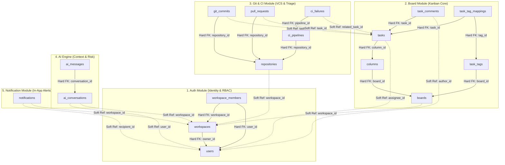

# Thiết Kế Cơ Sở Dữ Liệu Toàn Hệ Thống (Database Architecture & ERD Specification) — DevFlow

> **Dự án:** DevFlow — Nền tảng điều phối công việc kỹ thuật thông minh cho nhóm phần mềm  
> **Môn học:** Thiết kế chương trình hướng dịch vụ (Service-Oriented Program Design)  
> **Kiến trúc:** Modular Monolith (Java 17, Spring Boot 3.4.5, PostgreSQL 17)  
> **Phiên bản:** 1.0.0 (Giai đoạn Milestone M1)  
> **Tài liệu đối chiếu:** [docs/DATABASE_DESIGN.md](file:///docs/DATABASE_DESIGN.md) (English version) | [docs/ARCHITECTURE_VI.md](file:///docs/ARCHITECTURE_VI.md)

---

## 1. Tổng Quan Kiến Trúc & Triết Lý Hướng Dịch Vụ (SOA)

### 1.1. Bối cảnh & Mục tiêu Thiết kế
Hệ thống **DevFlow** tích hợp 5 phân hệ nghiệp vụ cốt lõi:
1. **Auth & Identity:** Quản lý tài khoản, phiên làm việc, không gian làm việc (Workspace) và phân quyền vai trò (RBAC).
2. **Board & Task Management:** Quản lý bảng Kanban trực quan, các cột trạng thái tiến độ, thẻ công việc (Task), bình luận và nhãn phân loại (Tags).
3. **Git & CI/CD Integration:** Theo dõi tích hợp VCS (GitHub/GitLab), commits, pull requests, webhook bắt sự kiện và log lỗi pipeline CI/CD.
4. **AI Engine:** Trợ lý ảo tóm tắt nguyên nhân lỗi CI, đánh giá rủi ro trễ hạn sprint và giao tiếp ngữ cảnh với kỹ sư phần mềm.
5. **Notification:** Hệ thống thông báo in-app theo thời gian thực (hỗ trợ WebSocket đẩy tin và REST truy vấn lịch sử).

Nhằm tối ưu hóa chi phí vận hành, giảm tải hạ tầng cục bộ và duy trì tính tinh gọn trong giai đoạn đầu, hệ thống sử dụng một cụm **PostgreSQL 17** duy nhất. Tuy nhiên, về mặt thiết kế logic, DevFlow tuân thủ nghiêm ngặt nguyên lý **Database-per-Module**:
- Mỗi module độc quyền sở hữu tập bảng của riêng mình.
- Tuyệt đối cấm các liên kết khóa ngoại vật lý (`FOREIGN KEY ... REFERENCES`) bắc cầu giữa hai module khác nhau.
- Mọi quan hệ liên phân hệ được chuẩn hóa thành **Tham chiếu mềm qua UUID (Soft Reference)** kết hợp với **Public API Interface** và **Domain Event Bus** để đồng bộ dữ liệu.

---

### 1.2. Phân Tích Chuyên Sâu: Hard Foreign Key vs Soft Reference UUID

Trong các hệ thống Monolith truyền thống, lập trình viên thường lạm dụng khóa ngoại vật lý (Hard Foreign Key) cho tất cả các bảng. Dưới góc nhìn của môn học **Thiết kế chương trình hướng dịch vụ (SOA)**, đây là nguyên nhân trực tiếp dẫn tới hiện tượng "khối gắn kết nguyên khối" (Monolithic Coupling), vô hiệu hóa khả năng tách microservices trong tương lai.

```
[Server 1 — PostgreSQL Instance A]          [Server 2 — PostgreSQL Instance B]
        Module Auth                                  Module Board
       ┌───────────┐                                ┌───────────┐
       │   users   │                                │   tasks   │
       │ (id: u1)  │ < - - - - - - - - - - - - - -  │(assignee) │
       └───────────┘        BẤT KHẢ THI!            └───────────┘
                    RDBMS KHÔNG THỂ TẠO KHÓA NGOẠI
                      QUA MẠNG (HTTP / NETWORK)
```

#### A. Bản chất tầng sâu trong động cơ RDBMS (Under The Hood):
1. **Khi ghi dữ liệu (`INSERT / UPDATE` vào bảng con):**
   - **Soft Reference (`UUID` thuần):** PostgreSQL chỉ tốn đúng 16 bytes nhị phân ghi vào data page của bảng con và cập nhật index. Quá trình hoàn tất trong micro-giây mà không phụ thuộc vào trạng thái bảng cha.
   - **Hard Foreign Key (`REFERENCES`):** Động cơ RDBMS tạm dừng thao tác ghi, kích hoạt internal check trigger truy vấn index bảng cha, đồng thời áp đặt một **Khóa chia sẻ (Shared Lock: `FOR KEY SHARE`)** lên bản ghi của bảng cha. Điều này làm gia tăng contention và giảm thông lượng (throughput) ghi đồng thời.
2. **Khi xóa hoặc cập nhật bảng cha (`DELETE / UPDATE`):**
   - **Soft Reference:** Bản ghi cha được xóa tức thì. Bảng con không bị khóa dòng, không bị quét index, không phát sinh locking tree.
   - **Hard FK (`ON DELETE CASCADE / RESTRICT`):** RDBMS phải quét toàn bộ bảng con. Nếu thiết lập `CASCADE`, hàng loạt khóa độc quyền (`Row-Exclusive Locks`) bị áp đặt trên bảng con, dễ gây ra **Tắc nghẽn / Xung đột khóa (Deadlock)** khi có nhiều kỹ sư cùng cập nhật task trong bảng Kanban.
3. **Hiểm họa vỡ ranh giới với ORM (Hibernate / JPA):**
   - Nếu tồn tại Hard FK ở CSDL, lập trình viên rất dễ khai báo `@ManyToOne private UserEntity assignee;` trong `TaskEntity`.
   - Hậu quả: Tầng nghiệp vụ của module Board có thể truy cập trực tiếp `task.getAssignee().getPasswordHash()`, phá vỡ nguyên tắc đóng gói (Data Encapsulation) và bảo mật thông tin tài khoản.

---

### 1.3. Bảng So Sánh Chiến Lược Khóa Ngoại

| Tiêu chí | Soft Reference (UUID thuần) | Hard Foreign Key (`REFERENCES`) |
|---|---|---|
| **Bản chất** | **Dữ liệu thụ động (Passive Data)** | **Luật cưỡng chế toàn vẹn + Khóa dòng ngầm** |
| **Dung lượng lưu trữ** | 16 bytes (UUID) | 16 bytes (UUID) + 1 bản ghi `pg_constraint` |
| **Hiệu năng ghi (Write)** | Tối đa, ghi trực tiếp, không phụ thuộc bảng khác | Phải truy vấn index bảng cha + giữ `FOR KEY SHARE` |
| **Nguy cơ Deadlock** | Triệt tiêu (hoàn toàn độc lập giữa các giao dịch) | Tiềm ẩn cao khi có nhiều transaction đồng thời |
| **Tính khả thi Microservices**| Sẵn sàng 100% khi tách DB sang server riêng | Bất khả thi nếu không sửa lại schema và code |
| **Phạm vi áp dụng tại DevFlow**| **Inter-module (Giữa 2 module khác nhau)** | **Intra-module (Nội bộ cùng một module)** |
| **Cơ chế đảm bảo toàn vẹn**| **Public API + Domain Events (Eventual Consistency)**| **Động cơ RDBMS (ACID Constraints)** |

---

## 2. Sơ Đồ Thực Thể - Quan Hệ Toàn Hệ Thống (System ERD)

Toàn bộ hệ thống DevFlow bao gồm **16 bảng** được phân bổ về 5 module nghiệp vụ:

### 2.1. Sơ Đồ Ranh Giới Tổng Thể (High-Level Domain ERD)

Sơ đồ mô tả quyền sở hữu bảng của từng module và các kênh tham chiếu mềm (Soft Reference UUID) xuyên qua ranh giới dịch vụ:



---

### 2.2. Chi Tiết Thực Thể & Thuộc Tính (Detailed ERD)
Mã nguồn Mermaid chi tiết của 16 bảng với đầy đủ thuộc tính, kiểu dữ liệu PostgreSQL, các chỉ mục và quan hệ khóa ngoại nội bộ được lưu độc lập tại:  
👉 **[docs/diagrams/database-erd.mmd](file:///docs/diagrams/database-erd.mmd)**

---

## 3. Data Dictionary Chi Tiết (16 Bảng Thuộc 5 Module)

### 3.1. Module 1: Auth & Identity (`auth`)

Quản lý danh tính người dùng, không gian làm việc (Workspace) và vai trò phân quyền.

#### Bảng `users`
Lưu trữ thông tin tài khoản và định danh cá nhân của người dùng.

| Tên cột | Kiểu dữ liệu | Thuộc tính | Mô tả nghiệp vụ & Ràng buộc |
|---|---|---|---|
| `id` | `UUID` | PK, NOT NULL, DEFAULT `gen_random_uuid()` | Khóa chính định danh tài khoản người dùng |
| `email` | `VARCHAR(255)` | UK, NOT NULL | Email đăng nhập duy nhất (`uq_users_email`) |
| `password_hash`| `VARCHAR(255)` | NOT NULL | Mật khẩu băm (BCrypt định dạng `$2a$10$...`) |
| `full_name` | `VARCHAR(255)` | NOT NULL | Họ và tên hiển thị của kỹ sư |
| `avatar_url` | `VARCHAR(512)` | NULL | Đường dẫn ảnh đại diện (CDN hoặc gravatar) |
| `created_at` | `TIMESTAMPTZ` | NOT NULL, DEFAULT `CURRENT_TIMESTAMP` | Thời điểm tạo tài khoản |
| `updated_at` | `TIMESTAMPTZ` | NOT NULL, DEFAULT `CURRENT_TIMESTAMP` | Thời điểm cập nhật thông tin gần nhất |

- **Chỉ mục:** `idx_users_email` trên `(email)` (B-tree, phục vụ tra cứu đăng nhập tức thì).

---

#### Bảng `workspaces`
Không gian làm việc cho một nhóm dự án hoặc phòng ban kỹ thuật.

| Tên cột | Kiểu dữ liệu | Thuộc tính | Mô tả nghiệp vụ & Ràng buộc |
|---|---|---|---|
| `id` | `UUID` | PK, NOT NULL, DEFAULT `gen_random_uuid()` | Khóa chính định danh workspace |
| `name` | `VARCHAR(255)` | NOT NULL | Tên không gian làm việc (ví dụ: "DevFlow Core Team") |
| `slug` | `VARCHAR(100)` | UK, NOT NULL | URL thân thiện duy nhất (`uq_workspaces_slug`, ví dụ: `devflow-core`) |
| `owner_id` | `UUID` | FK, NOT NULL | Khóa ngoại nội bộ trỏ tới `users(id)` ON DELETE RESTRICT |
| `created_at` | `TIMESTAMPTZ` | NOT NULL, DEFAULT `CURRENT_TIMESTAMP` | Thời điểm khởi tạo workspace |
| `updated_at` | `TIMESTAMPTZ` | NOT NULL, DEFAULT `CURRENT_TIMESTAMP` | Thời điểm sửa đổi workspace |

- **Chỉ mục:**
  - `idx_workspaces_slug` trên `(slug)`.
  - `idx_workspaces_owner_id` trên `(owner_id)`.

---

#### Bảng `workspace_members`
Bảng liên kết quản lý thành viên và quyền hạn trong workspace.

| Tên cột | Kiểu dữ liệu | Thuộc tính | Mô tả nghiệp vụ & Ràng buộc |
|---|---|---|---|
| `id` | `UUID` | PK, NOT NULL, DEFAULT `gen_random_uuid()` | Khóa chính bản ghi thành viên |
| `workspace_id`| `UUID` | FK, NOT NULL | Khóa ngoại nội bộ `workspaces(id)` ON DELETE CASCADE |
| `user_id` | `UUID` | FK, NOT NULL | Khóa ngoại nội bộ `users(id)` ON DELETE CASCADE |
| `role` | `VARCHAR(50)` | NOT NULL, DEFAULT `'MEMBER'` | Vai trò trong nhóm: `OWNER`, `ADMIN`, `MEMBER` |
| `created_at` | `TIMESTAMPTZ` | NOT NULL, DEFAULT `CURRENT_TIMESTAMP` | Thời điểm gia nhập nhóm |
| `updated_at` | `TIMESTAMPTZ` | NOT NULL, DEFAULT `CURRENT_TIMESTAMP` | Thời điểm thay đổi quyền hạn |

- **Ràng buộc:** `uq_workspace_member UNIQUE (workspace_id, user_id)`.
- **Chỉ mục:**
  - `idx_workspace_members_workspace` trên `(workspace_id)`.
  - `idx_workspace_members_user` trên `(user_id)`.
  - `idx_workspace_members_user_ws` trên `(workspace_id, user_id)` (kiểm tra quyền truy cập).

---

### 3.2. Module 2: Board & Task Management (`board`)

Quản lý vòng đời công việc, bảng Kanban, các cột trạng thái, bình luận và nhãn phân loại.

#### Bảng `boards`
Bảng Kanban thuộc về một workspace.

| Tên cột | Kiểu dữ liệu | Thuộc tính | Mô tả nghiệp vụ & Ràng buộc |
|---|---|---|---|
| `id` | `UUID` | PK, NOT NULL, DEFAULT `gen_random_uuid()` | Khóa chính bảng Kanban |
| `workspace_id`| `UUID` | NOT NULL | **Soft Reference** trỏ tới `workspaces.id` (Module Auth) |
| `name` | `VARCHAR(255)` | NOT NULL | Tên bảng (ví dụ: "Sprint 1 — Core Features") |
| `description` | `TEXT` | NULL | Mô tả mục tiêu của bảng công việc |
| `is_archived` | `BOOLEAN` | NOT NULL, DEFAULT `FALSE` | Cờ đánh dấu đã lưu trữ bảng |
| `created_at` | `TIMESTAMPTZ` | NOT NULL, DEFAULT `CURRENT_TIMESTAMP` | Thời điểm tạo bảng |
| `updated_at` | `TIMESTAMPTZ` | NOT NULL, DEFAULT `CURRENT_TIMESTAMP` | Thời điểm chỉnh sửa |

- **Chỉ mục:** `idx_boards_workspace` trên `(workspace_id)` (lấy danh sách bảng theo workspace).

---

#### Bảng `columns`
Các cột quy trình trạng thái công việc trên bảng Kanban.

| Tên cột | Kiểu dữ liệu | Thuộc tính | Mô tả nghiệp vụ & Ràng buộc |
|---|---|---|---|
| `id` | `UUID` | PK, NOT NULL, DEFAULT `gen_random_uuid()` | Khóa chính cột Kanban |
| `board_id` | `UUID` | FK, NOT NULL | Khóa ngoại nội bộ `boards(id)` ON DELETE CASCADE |
| `name` | `VARCHAR(100)` | NOT NULL | Tên cột (ví dụ: "To Do", "In Progress", "Done") |
| `position` | `INT` | NOT NULL | Thứ tự sắp xếp từ trái sang phải (bắt đầu từ 0) |
| `status_category`| `VARCHAR(50)`| NOT NULL | Nhóm trạng thái chuẩn: `TODO`, `IN_PROGRESS`, `IN_REVIEW`, `DONE` |
| `created_at` | `TIMESTAMPTZ` | NOT NULL, DEFAULT `CURRENT_TIMESTAMP` | Thời điểm tạo cột |
| `updated_at` | `TIMESTAMPTZ` | NOT NULL, DEFAULT `CURRENT_TIMESTAMP` | Thời điểm sửa đổi cột |

- **Chỉ mục:** `idx_columns_board_position` trên `(board_id, position)` (render thứ tự các cột).

---

#### Bảng `tasks`
Thẻ công việc (Task / Ticket) lưu thông tin nhiệm vụ của lập trình viên.

| Tên cột | Kiểu dữ liệu | Thuộc tính | Mô tả nghiệp vụ & Ràng buộc |
|---|---|---|---|
| `id` | `UUID` | PK, NOT NULL, DEFAULT `gen_random_uuid()` | Khóa chính định danh task |
| `column_id` | `UUID` | FK, NOT NULL | Khóa ngoại nội bộ `columns(id)` ON DELETE CASCADE |
| `title` | `VARCHAR(255)` | NOT NULL | Tiêu đề công việc ngắn gọn, rõ ràng |
| `description` | `TEXT` | NULL | Mô tả chi tiết nội dung, hỗ trợ Markdown |
| `position` | `INT` | NOT NULL | Thứ tự thẻ trong cột (phục vụ kéo thả reorder) |
| `priority` | `VARCHAR(50)` | NOT NULL, DEFAULT `'MEDIUM'` | Mức độ ưu tiên: `LOW`, `MEDIUM`, `HIGH`, `URGENT` |
| `assignee_id` | `UUID` | NULL | **Soft Reference** trỏ tới `users.id` (Module Auth) |
| `due_date` | `TIMESTAMPTZ` | NULL | Hạn chót hoàn thành (deadline) |
| `created_at` | `TIMESTAMPTZ` | NOT NULL, DEFAULT `CURRENT_TIMESTAMP` | Thời điểm tạo task |
| `updated_at` | `TIMESTAMPTZ` | NOT NULL, DEFAULT `CURRENT_TIMESTAMP` | Thời điểm cập nhật task |

- **Chỉ mục:**
  - `idx_tasks_column_position` trên `(column_id, position)` (tối ưu hóa kéo thả Kanban DnD).
  - `idx_tasks_assignee` trên `(assignee_id)` (tìm nhanh các task được giao cho một cá nhân).
  - `idx_tasks_due_date` trên `(due_date)` (phục vụ AI quét phát hiện trễ hạn).

---

#### Bảng `task_comments`
Bình luận và trao đổi thảo luận dưới từng thẻ công việc.

| Tên cột | Kiểu dữ liệu | Thuộc tính | Mô tả nghiệp vụ & Ràng buộc |
|---|---|---|---|
| `id` | `UUID` | PK, NOT NULL, DEFAULT `gen_random_uuid()` | Khóa chính bình luận |
| `task_id` | `UUID` | FK, NOT NULL | Khóa ngoại nội bộ `tasks(id)` ON DELETE CASCADE |
| `author_id` | `UUID` | NOT NULL | **Soft Reference** trỏ tới `users.id` (Module Auth) |
| `content` | `TEXT` | NOT NULL | Nội dung bình luận (hỗ trợ Markdown) |
| `created_at` | `TIMESTAMPTZ` | NOT NULL, DEFAULT `CURRENT_TIMESTAMP` | Thời điểm gửi bình luận |
| `updated_at` | `TIMESTAMPTZ` | NOT NULL, DEFAULT `CURRENT_TIMESTAMP` | Thời điểm chỉnh sửa bình luận |

- **Chỉ mục:** `idx_task_comments_task_created` trên `(task_id, created_at ASC)`.

---

#### Bảng `task_tags`
Danh mục các thẻ nhãn phân loại trong một bảng công việc.

| Tên cột | Kiểu dữ liệu | Thuộc tính | Mô tả nghiệp vụ & Ràng buộc |
|---|---|---|---|
| `id` | `UUID` | PK, NOT NULL, DEFAULT `gen_random_uuid()` | Khóa chính nhãn tag |
| `board_id` | `UUID` | FK, NOT NULL | Khóa ngoại nội bộ `boards(id)` ON DELETE CASCADE |
| `name` | `VARCHAR(50)` | NOT NULL | Tên thẻ nhãn (ví dụ: `bug`, `feature`, `backend`) |
| `color` | `VARCHAR(20)` | NOT NULL | Mã màu hiển thị (ví dụ: `#EF4444`, `red`) |

- **Chỉ mục:** `idx_task_tags_board` trên `(board_id)`.

---

#### Bảng `task_tag_mappings`
Bảng trung gian thiết lập quan hệ Nhiều - Nhiều (N:M) giữa Task và Tag.

| Tên cột | Kiểu dữ liệu | Thuộc tính | Mô tả nghiệp vụ & Ràng buộc |
|---|---|---|---|
| `task_id` | `UUID` | FK, NOT NULL | Khóa ngoại nội bộ `tasks(id)` ON DELETE CASCADE |
| `tag_id` | `UUID` | FK, NOT NULL | Khóa ngoại nội bộ `task_tags(id)` ON DELETE CASCADE |

- **Ràng buộc:** Khóa chính kết hợp `PRIMARY KEY (task_id, tag_id)`.
- **Chỉ mục:** `idx_tag_mappings_tag` trên `(tag_id)`.

---

### 3.3. Module 3: Git & CI Integration (`gitci`)

Lưu trữ thông tin tích hợp kho mã nguồn VCS, nhật ký commit, yêu cầu kéo (Pull Request), và lịch sử kiểm thử tự động (CI Pipelines).

#### Bảng `repositories`
Kho mã nguồn từ GitHub hoặc GitLab được tích hợp vào hệ thống.

| Tên cột | Kiểu dữ liệu | Thuộc tính | Mô tả nghiệp vụ & Ràng buộc |
|---|---|---|---|
| `id` | `UUID` | PK, NOT NULL, DEFAULT `gen_random_uuid()` | Khóa chính repository |
| `workspace_id`| `UUID` | NOT NULL | **Soft Reference** trỏ tới `workspaces.id` (Module Auth) |
| `provider` | `VARCHAR(50)` | NOT NULL | Nhà cung cấp VCS: `GITHUB`, `GITLAB` |
| `remote_repo_id`| `VARCHAR(100)`| NOT NULL | ID hoặc full path phía máy chủ từ xa (ví dụ: `owner/repo`) |
| `name` | `VARCHAR(255)` | NOT NULL | Tên đại diện hiển thị |
| `webhook_secret`| `VARCHAR(255)`| NOT NULL | Khóa bảo mật đối soát chữ ký số HMAC của webhook payload |
| `created_at` | `TIMESTAMPTZ` | NOT NULL, DEFAULT `CURRENT_TIMESTAMP` | Thời điểm kết nối repo |
| `updated_at` | `TIMESTAMPTZ` | NOT NULL, DEFAULT `CURRENT_TIMESTAMP` | Thời điểm cập nhật |

- **Chỉ mục:** `idx_repositories_workspace` trên `(workspace_id)`.

---

#### Bảng `git_commits`
Nhật ký các commit được đồng bộ từ Webhook.

| Tên cột | Kiểu dữ liệu | Thuộc tính | Mô tả nghiệp vụ & Ràng buộc |
|---|---|---|---|
| `id` | `UUID` | PK, NOT NULL, DEFAULT `gen_random_uuid()` | Khóa chính bản ghi commit |
| `repository_id`| `UUID` | FK, NOT NULL | Khóa ngoại nội bộ `repositories(id)` ON DELETE CASCADE |
| `sha` | `VARCHAR(64)` | UK, NOT NULL | Mã băm commit SHA-1/SHA-256 (`uq_git_commits_sha`) |
| `message` | `TEXT` | NOT NULL | Thông điệp commit đầy đủ |
| `author_name` | `VARCHAR(255)` | NOT NULL | Tên tác giả commit |
| `author_email`| `VARCHAR(255)` | NOT NULL | Email của tác giả commit |
| `task_id` | `UUID` | NULL | **Soft Reference** trỏ tới `tasks.id` (Module Board) |
| `committed_at`| `TIMESTAMPTZ` | NOT NULL | Thời điểm commit được tạo trên máy tính lập trình viên |
| `created_at` | `TIMESTAMPTZ` | NOT NULL, DEFAULT `CURRENT_TIMESTAMP` | Thời điểm hệ thống nhận webhook |

- **Chỉ mục:**
  - `idx_git_commits_repo` trên `(repository_id)`.
  - `idx_git_commits_task_id` trên `(task_id)` (truy vấn danh sách commit liên quan tới 1 task).

---

#### Bảng `pull_requests`
Theo dõi các yêu cầu kéo mã nguồn (PR) trên Git.

| Tên cột | Kiểu dữ liệu | Thuộc tính | Mô tả nghiệp vụ & Ràng buộc |
|---|---|---|---|
| `id` | `UUID` | PK, NOT NULL, DEFAULT `gen_random_uuid()` | Khóa chính bản ghi PR |
| `repository_id`| `UUID` | FK, NOT NULL | Khóa ngoại nội bộ `repositories(id)` ON DELETE CASCADE |
| `pr_number` | `INT` | NOT NULL | Số định danh PR trên GitHub/GitLab (ví dụ: `#42`) |
| `title` | `VARCHAR(255)` | NOT NULL | Tiêu đề PR |
| `source_branch`| `VARCHAR(255)` | NOT NULL | Nhánh nguồn (ví dụ: `feature/T-002-entities`) |
| `target_branch`| `VARCHAR(255)` | NOT NULL | Nhánh đích (ví dụ: `main`, `develop`) |
| `status` | `VARCHAR(50)` | NOT NULL | Trạng thái: `OPEN`, `MERGED`, `CLOSED` |
| `task_id` | `UUID` | NULL | **Soft Reference** trỏ tới `tasks.id` (Module Board) |
| `pr_url` | `VARCHAR(512)` | NOT NULL | Đường dẫn web trực tiếp tới PR |
| `created_at` | `TIMESTAMPTZ` | NOT NULL, DEFAULT `CURRENT_TIMESTAMP` | Thời điểm mở PR |
| `updated_at` | `TIMESTAMPTZ` | NOT NULL, DEFAULT `CURRENT_TIMESTAMP` | Thời điểm cập nhật trạng thái PR |

- **Ràng buộc:** `uq_pr_repo_number UNIQUE (repository_id, pr_number)`.
- **Chỉ mục:**
  - `idx_pull_requests_task_id` trên `(task_id)`.
  - `idx_pull_requests_repo_status` trên `(repository_id, status)`.

---

#### Bảng `ci_pipelines`
Lịch sử các lần chạy kiểm thử và build tự động của CI/CD.

| Tên cột | Kiểu dữ liệu | Thuộc tính | Mô tả nghiệp vụ & Ràng buộc |
|---|---|---|---|
| `id` | `UUID` | PK, NOT NULL, DEFAULT `gen_random_uuid()` | Khóa chính định danh đợt chạy pipeline |
| `repository_id`| `UUID` | FK, NOT NULL | Khóa ngoại nội bộ `repositories(id)` ON DELETE CASCADE |
| `pipeline_id` | `VARCHAR(100)` | NOT NULL | ID đợt chạy phía máy chủ CI (ví dụ GitHub Run ID) |
| `commit_sha` | `VARCHAR(64)` | NOT NULL | Mã commit được đem đi build |
| `branch` | `VARCHAR(255)` | NOT NULL | Nhánh git được kích hoạt build |
| `status` | `VARCHAR(50)` | NOT NULL | Trạng thái: `PENDING`, `RUNNING`, `SUCCESS`, `FAILED` |
| `started_at` | `TIMESTAMPTZ` | NULL | Thời điểm bắt đầu chạy kiểm thử |
| `finished_at` | `TIMESTAMPTZ` | NULL | Thời điểm kết thúc chạy kiểm thử |
| `created_at` | `TIMESTAMPTZ` | NOT NULL, DEFAULT `CURRENT_TIMESTAMP` | Thời điểm ghi nhận bản ghi |

- **Chỉ mục:**
  - `idx_ci_pipelines_repo_status` trên `(repository_id, status)`.
  - `idx_ci_pipelines_commit_sha` trên `(commit_sha)`.

---

#### Bảng `ci_failures`
Chi tiết các lỗi gãy build của pipeline cần AI phân tích và khắc phục.

| Tên cột | Kiểu dữ liệu | Thuộc tính | Mô tả nghiệp vụ & Ràng buộc |
|---|---|---|---|
| `id` | `UUID` | PK, NOT NULL, DEFAULT `gen_random_uuid()` | Khóa chính định danh bản ghi lỗi |
| `pipeline_id` | `UUID` | FK, NOT NULL | Khóa ngoại nội bộ `ci_pipelines(id)` ON DELETE CASCADE |
| `stage_name` | `VARCHAR(100)` | NOT NULL | Tên công đoạn bị lỗi (ví dụ: `unit-test`, `lint`) |
| `job_name` | `VARCHAR(100)` | NOT NULL | Tên công việc cụ thể bị gãy |
| `error_summary`| `TEXT` | NULL | Tóm tắt thông báo lỗi trích xuất từ log |
| `raw_log_snippet`| `TEXT` | NULL | Đoạn log thô chứa stack trace gây lỗi |
| `ai_summary` | `TEXT` | NULL | Kết quả phân tích nguyên nhân gốc rễ do AI sinh ra |
| `related_task_id`| `UUID` | NULL | **Soft Reference** trỏ tới `tasks.id` (Module Board) |
| `created_at` | `TIMESTAMPTZ` | NOT NULL, DEFAULT `CURRENT_TIMESTAMP` | Thời điểm ghi nhận |

- **Chỉ mục:**
  - `idx_ci_failures_pipeline` trên `(pipeline_id)`.
  - `idx_ci_failures_related_task` trên `(related_task_id)`.

---

### 3.4. Module 4: AI Engine (`ai`)

Quản lý lịch sử hội thoại của trợ lý ảo và các ngữ cảnh trao đổi tóm tắt nguyên nhân lỗi.

#### Bảng `ai_conversations`
Phiên trao đổi giữa người dùng và trợ lý AI trong một workspace.

| Tên cột | Kiểu dữ liệu | Thuộc tính | Mô tả nghiệp vụ & Ràng buộc |
|---|---|---|---|
| `id` | `UUID` | PK, NOT NULL, DEFAULT `gen_random_uuid()` | Khóa chính phiên hội thoại |
| `workspace_id`| `UUID` | NOT NULL | **Soft Reference** trỏ tới `workspaces.id` (Module Auth) |
| `user_id` | `UUID` | NOT NULL | **Soft Reference** trỏ tới `users.id` (Module Auth) |
| `title` | `VARCHAR(255)` | NOT NULL | Tiêu đề gợi nhớ cuộc trò chuyện |
| `created_at` | `TIMESTAMPTZ` | NOT NULL, DEFAULT `CURRENT_TIMESTAMP` | Thời điểm khởi tạo |
| `updated_at` | `TIMESTAMPTZ` | NOT NULL, DEFAULT `CURRENT_TIMESTAMP` | Thời điểm có tin nhắn mới |

- **Chỉ mục:** `idx_ai_conversations_user` trên `(workspace_id, user_id)`.

---

#### Bảng `ai_messages`
Các câu hỏi và câu trả lời trong phiên hội thoại AI.

| Tên cột | Kiểu dữ liệu | Thuộc tính | Mô tả nghiệp vụ & Ràng buộc |
|---|---|---|---|
| `id` | `UUID` | PK, NOT NULL, DEFAULT `gen_random_uuid()` | Khóa chính tin nhắn |
| `conversation_id`| `UUID` | FK, NOT NULL | Khóa ngoại nội bộ `ai_conversations(id)` ON DELETE CASCADE |
| `sender_type` | `VARCHAR(50)` | NOT NULL | Loại người gửi: `USER`, `ASSISTANT`, `SYSTEM` |
| `content` | `TEXT` | NOT NULL | Nội dung câu chat (Markdown hoặc JSON snippet) |
| `tokens_used` | `INT` | NOT NULL, DEFAULT 0 | Số lượng token tiêu thụ phục vụ kiểm soát hạn mức |
| `created_at` | `TIMESTAMPTZ` | NOT NULL, DEFAULT `CURRENT_TIMESTAMP` | Thời điểm phát sinh tin nhắn |

- **Chỉ mục:** `idx_ai_messages_conv_created` trên `(conversation_id, created_at ASC)`.

---

### 3.5. Module 5: Notification (`notification`)

Hàng đợi thông báo và lịch sử cảnh báo gửi tới người dùng.

#### Bảng `notifications`
Thông báo in-app gửi tới thành viên kỹ thuật.

| Tên cột | Kiểu dữ liệu | Thuộc tính | Mô tả nghiệp vụ & Ràng buộc |
|---|---|---|---|
| `id` | `UUID` | PK, NOT NULL, DEFAULT `gen_random_uuid()` | Khóa chính thông báo |
| `recipient_id`| `UUID` | NOT NULL | **Soft Reference** trỏ tới `users.id` (Module Auth) |
| `workspace_id`| `UUID` | NOT NULL | **Soft Reference** trỏ tới `workspaces.id` (Module Auth) |
| `title` | `VARCHAR(255)` | NOT NULL | Tiêu đề thông báo ngắn gọn |
| `content` | `TEXT` | NOT NULL | Nội dung chi tiết thông báo |
| `type` | `VARCHAR(50)` | NOT NULL | Loại thông báo: `TASK_ASSIGNED`, `CI_FAILED`, `RISK_ALERT`, `SYSTEM` |
| `reference_type`| `VARCHAR(50)`| NULL | Phân loại đối tượng liên kết: `TASK`, `PIPELINE` |
| `reference_id` | `UUID` | NULL | **Soft Reference** trỏ tới `tasks.id` hoặc `ci_pipelines.id` |
| `is_read` | `BOOLEAN` | NOT NULL, DEFAULT `FALSE` | Trạng thái đã xem hay chưa đọc |
| `created_at` | `TIMESTAMPTZ` | NOT NULL, DEFAULT `CURRENT_TIMESTAMP` | Thời điểm phát sinh thông báo |

- **Chỉ mục:**
  - `idx_notifications_recipient_unread` trên `(recipient_id, is_read)` (lấy danh sách thông báo chưa đọc).
  - `idx_notifications_recipient_created` trên `(recipient_id, created_at DESC)` (lấy lịch sử thông báo phân trang).

---

## 4. Ma Trận Trao Đổi Dữ Liệu & Ranh Giới Liên Phân Hệ (Inter-Module Data Matrix)

Nguyên tắc tối thượng: **Tuyệt đối không JOIN trực tiếp giữa các bảng thuộc module khác nhau ở tầng Repository.** Việc tổng hợp thông tin được thực hiện thông qua **Public API Interface (Synchronous Queries)** hoặc **Domain Events (Asynchronous Updates)**.

| Bảng nguồn | Cột tham chiếu | Thực thể đích (Module) | Loại Ref | Cơ chế đồng bộ & Ràng buộc nghiệp vụ |
|---|---|---|---|---|
| `boards` | `workspace_id` | `workspaces` (Auth) | **Soft UUID** | Board Service gọi `AuthApi.isWorkspaceMember(userId, workspaceId)` để xác thực quyền tạo/sửa bảng. |
| `tasks` | `assignee_id` | `users` (Auth) | **Soft UUID** | Khi trả về Task DTO, Board Service gọi `AuthApi.findUserSummary(assigneeId)` để hiển thị tên và avatar mà không cần đọc bảng `users`. |
| `tasks` | `assignee_id` | `users` (Auth) | **Soft UUID** | Khi User bị xóa khỏi Workspace, Auth bắn event `user.removed_from_workspace`. Board Listener nhận event và gỡ gán task (`assignee_id = NULL`). |
| `task_comments`| `author_id` | `users` (Auth) | **Soft UUID** | Hiển thị thông tin người bình luận thông qua `AuthApi.findUserSummary(authorId)`. |
| `repositories`| `workspace_id` | `workspaces` (Auth) | **Soft UUID** | Kiểm tra quyền `ADMIN` của user trong workspace trước khi cấp phép cấu hình webhook. |
| `git_commits` | `task_id` | `tasks` (Board) | **Soft UUID** | GitCI Module bóc tách mã task từ commit message (`Refs #T-101`), gọi `BoardApi.taskExists(taskId)` hoặc bắn sự kiện `git.commit_linked`. |
| `pull_requests`| `task_id` | `tasks` (Board) | **Soft UUID** | Khi PR được merge, GitCI phát sự kiện `git.pr_merged`. Board lắng nghe và tự động dời thẻ sang cột có `status_category = 'DONE'`. |
| `ci_failures` | `related_task_id`| `tasks` (Board) | **Soft UUID** | AI Service phân tích stack trace, đối chiếu commit sha ra task id tương ứng và gán vào trường này. |
| `ai_conversations`| `user_id` / `workspace_id` | `users` / `workspaces` (Auth) | **Soft UUID** | Xác thực phiên làm việc thông qua Bearer JWT Token ở Security Filter Chain trước khi vào AI Module. |
| `notifications`| `recipient_id`| `users` (Auth) | **Soft UUID** | Notification Service lắng nghe các sự kiện (ví dụ `board.task_assigned`, `ci.failure_detected`) để tạo bản ghi thông báo tương ứng. |
| `notifications`| `reference_id`| `tasks` / `ci_pipelines` | **Soft UUID** | Frontend dùng trường này để deep-link trực tiếp đến màn hình chi tiết công việc hoặc chi tiết pipeline gãy. |

---

## 5. Chiến Lược Đánh Chỉ Mục & Tối Ưu Hiệu Năng (Indexing Strategy)

Để hệ thống đạt độ trễ phản hồi thấp ($P_{99} \le 100\text{ms}$) mà không cần các câu lệnh SQL JOIN cồng kềnh:

```
[REST Client / Frontend]
        │
        ▼
   (Task Query) ──► SELECT * FROM tasks WHERE column_id = ? ORDER BY position ASC
                     └──► Sử dụng Index: idx_tasks_column_position (B-tree Index)
```

### 5.1. Nhóm chỉ mục bảo đảm toàn vẹn và tìm kiếm duy nhất (Unique Indexes)
- `users(email)`: Định danh đăng nhập tài khoản.
- `workspaces(slug)`: URL routing không gian làm việc.
- `workspace_members(workspace_id, user_id)`: Ngăn chặn thêm trùng thành viên vào một nhóm.
- `git_commits(sha)`: Ngăn chặn xử lý trùng lặp webhook commit.
- `pull_requests(repository_id, pr_number)`: Định danh duy nhất PR theo từng kho mã nguồn.

### 5.2. Nhóm chỉ mục khóa ngoại nội bộ & phân cấp cha - con (Parent-Child Indexes)
- `columns(board_id, position)`: Lấy toàn bộ các cột Kanban theo đúng thứ tự bố trí.
- `tasks(column_id, position)`: Tối ưu hóa cực lớn cho thao tác kéo thả thẻ công việc (Drag and Drop).
- `task_comments(task_id, created_at ASC)`: Lấy lịch sử hội thoại dưới task theo trình tự thời gian.
- `ci_pipelines(repository_id, status)`: Lọc nhanh các đợt kiểm thử bị thất bại (`status = 'FAILED'`).
- `ci_failures(pipeline_id)`: Tải nhanh danh sách lỗi của một đợt build.

### 5.3. Nhóm chỉ mục tham chiếu mềm liên module (Soft Reference Indexes)
- `tasks(assignee_id)`: Tìm toàn bộ các task được phân công cho một kỹ sư cụ thể trên bảng.
- `git_commits(task_id)` & `pull_requests(task_id)`: Liệt kê nhanh toàn bộ hoạt động mã nguồn gắn liền với task.
- `notifications(recipient_id, is_read)`: Tải số lượng huy hiệu thông báo chưa đọc (Unread Badge Count) trong thời gian thực.

---

## 6. Lộ Trình Triển Khai CSDL Với Flyway (Migration Roadmap)

Để đảm bảo việc triển khai không làm gián đoạn hệ thống và tuân thủ lộ trình 5 giai đoạn tại [docs/IMPLEMENTATION_PLAN_VI.md](file:///docs/IMPLEMENTATION_PLAN_VI.md):

```
┌─────────────────────────────────────────────────────────────┐
│  Phase 1 (M1): V1__init_schema.sql (Auth & Foundation)      │
│  - users, workspaces, workspace_members                     │
└──────────────────────────────┬──────────────────────────────┘
                               │
                               ▼
┌─────────────────────────────────────────────────────────────┐
│  Phase 2 (M2): V2__board_schema.sql (Kanban Core)           │
│  - boards, columns, tasks, task_comments, task_tags,        │
│    task_tag_mappings                                        │
└──────────────────────────────┬──────────────────────────────┘
                               │
                               ▼
┌─────────────────────────────────────────────────────────────┐
│  Phase 3 (M3): V3__gitci_schema.sql (Git & CI Integration)   │
│  - repositories, git_commits, pull_requests, ci_pipelines,  │
│    ci_failures                                              │
└──────────────────────────────┬──────────────────────────────┘
                               │
                               ▼
┌─────────────────────────────────────────────────────────────┐
│  Phase 4 (M4): V4__ai_and_notification_schema.sql           │
│  - ai_conversations, ai_messages, notifications             │
└─────────────────────────────────────────────────────────────┘
```

1. **Giai đoạn 1 (Milestone M1 — Hiện tại):**
   - File: `backend/app/src/main/resources/db/migration/V1__init_schema.sql`
   - Bảng triển khai: `users`, `workspaces`, `workspace_members`.
   - Trạng thái: **Đã triển khai và khớp 100% với tài liệu thiết kế.**
2. **Giai đoạn 2 (Milestone M2 — Sprint 2 & 3):**
   - File: `V2__board_schema.sql`
   - Bảng triển khai: 6 bảng phân hệ Board.
   - Lưu ý: Cột `assignee_id` trong `tasks` khai báo `UUID NULL` thuần túy, tuyệt đối không thêm `REFERENCES users(id)`.
3. **Giai đoạn 3 (Milestone M3 — Sprint 4):**
   - File: `V3__gitci_schema.sql`
   - Bảng triển khai: 5 bảng phân hệ Git & CI.
   - Lưu ý: Cột `task_id` trong `git_commits` và `pull_requests` khai báo `UUID NULL` thuần túy.
4. **Giai đoạn 4 (Milestone M4 — Sprint 5):**
   - File: `V4__ai_and_notification_schema.sql`
   - Bảng triển khai: 2 bảng phân hệ AI và 1 bảng phân hệ Notification.

---

## 7. Báo Cáo Đối Soát Tính Nhất Quán (Consistency Audit với `V1__init_schema.sql`)

Tiến hành đối soát từng dòng mã giữa `V1__init_schema.sql` và thiết kế CSDL phân hệ Auth:

| Tiêu chí đối soát | Trong file `V1__init_schema.sql` | Trong tài liệu Thiết kế CSDL | Đánh giá |
|---|---|---|---|
| Kích hoạt tiện ích mở rộng | `CREATE EXTENSION IF NOT EXISTS "pgcrypto";` | Yêu cầu sinh `gen_random_uuid()` tự động | **Khớp 100%** |
| Cấu trúc bảng `users` | 7 cột, PK `id UUID`, UK `email`, `password_hash`, `full_name`, `avatar_url`, `created_at`, `updated_at` | Giống hoàn toàn | **Khớp 100%** |
| Khóa ngoại `workspaces` | `owner_id UUID REFERENCES users(id) ON DELETE RESTRICT` | Hard FK nội bộ phân hệ Auth | **Khớp 100%** |
| Cấu trúc `workspace_members` | Khóa ngoại `workspace_id` CASCADE, `user_id` CASCADE, UK `(workspace_id, user_id)` | Giống hoàn toàn | **Khớp 100%** |
| Danh mục chỉ mục Auth | `idx_users_email`, `idx_workspaces_slug`, `idx_workspaces_owner_id`, `idx_workspace_members_workspace`, `idx_workspace_members_user` | Đầy đủ theo thiết kế | **Khớp 100%** |

**Kết luận:** File migration nền tảng `V1__init_schema.sql` hoàn toàn chuẩn xác, sẵn sàng làm bệ phóng cho các giai đoạn tiếp theo.
