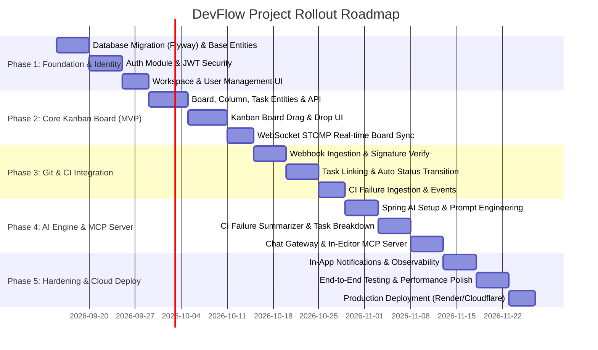

# DevFlow — Master Implementation Plan

> 🌐 **Language:** **English** (Authoritative Agent Best-Practice Guide) | [Bản Tiếng Việt (Dành cho Developer)](file:///c:/Users/Tien/university/ServiceOrientedProgramDesign/DevFlow/docs/IMPLEMENTATION_PLAN_VI.md)
>
> **Source-of-Truth References:**
> - Product Specification: [docs/PRODUCT_SPEC.md](file:///c:/Users/Tien/university/ServiceOrientedProgramDesign/DevFlow/docs/PRODUCT_SPEC.md)
> - System Architecture: [docs/ARCHITECTURE.md](file:///c:/Users/Tien/university/ServiceOrientedProgramDesign/DevFlow/docs/ARCHITECTURE.md)
> - Scaffold Audit Report: [AUDIT_REPORT.md](file:///c:/Users/Tien/university/ServiceOrientedProgramDesign/DevFlow/AUDIT_REPORT.md)
> - Task Tracker: [Trello Development Board](https://trello.com/b/CKoJR2cC/development)
>
> **Target Scope:** 1 Semester (10–12 weeks)  
> **Team Size:** 2 Developers  
> **Core Objective:** Deliver a production-grade, deployed, working software artifact adhering to strict Modular Monolith and Service-Oriented architecture principles.

---

## 1. Execution Strategy & Architectural Ground Rules

DevFlow is implemented as a **Modular Monolith** using Spring Boot 3.4.5 (Java 17) and React 19 (TypeScript, Vite, TailwindCSS v4). All contributors (humans and AI coding agents) must strictly adhere to:

1. **Strict Module Boundary Isolation (Zero Tolerance):**
   - No inter-module `impl -> impl` package imports (`io.devflow.<module>.internal.*`).
   - Cross-module communication **MUST** occur exclusively via the In-Process Event Bus (`DevFlowEvent` catalog in `:common`) or exported API interfaces (`:X-api`).
   - Every commit must pass `./gradlew :verifyModuleBoundaries`.
2. **Phase-Gated Incremental Delivery:**
   - Develop in sequential phases: Foundation & Auth → Core Kanban Board → Git/CI Integration → AI & MCP → Observability & Production Deploy.
   - Each phase delivers verified end-to-end functionality (Database migration + Backend API + Frontend UI + Automated tests).
3. **Database Migration Standard:**
   - Replace `hibernate.ddl-auto: update` with Flyway versioned SQL migrations (`V1__...`, `V2__...`).
   - Each module strictly owns its database tables.

---

## 2. Phase Breakdown & Engineering Specifications

### 📌 Phase 1: Foundation & Identity (Sprint 1)
- **Primary Goal:** Establish persistent database versioning via Flyway, replace stubs in `auth-impl` with production-grade Spring Security 6 stateless JWT authentication, and build frontend login/workspace onboarding.
- **Duration:** 2 weeks
- **Technical Scope:**
  1. **Flyway Migration (`:app`):**
     - Add `org.flywaydb:flyway-core` and `org.flywaydb:flyway-database-postgresql`.
     - Create `backend/app/src/main/resources/db/migration/V1__init_schema.sql` defining:
       - `users` (id UUID PRIMARY KEY, email VARCHAR UNIQUE, password_hash VARCHAR, full_name VARCHAR, avatar_url VARCHAR, created_at, updated_at).
       - `workspaces` (id UUID PRIMARY KEY, name VARCHAR, slug VARCHAR UNIQUE, owner_id UUID REFERENCES users, created_at, updated_at).
       - `workspace_members` (id UUID PRIMARY KEY, workspace_id UUID REFERENCES workspaces, user_id UUID REFERENCES users, role VARCHAR, created_at, updated_at).
  2. **Auth Service (`auth-impl`):**
     - Map JPA entities: `UserEntity`, `WorkspaceEntity`, `WorkspaceMemberEntity`.
     - Implement `JwtTokenProvider` (HS256 or RS256, access token expiration 1h, refresh token 7d).
     - Configure `SecurityFilterChain`: `/api/v1/auth/**` and public endpoints permitted; `/api/v1/**` requires authenticated JWT.
     - Implement `AuthApi` contract (`findUser(UUID)`, `isWorkspaceMember(UUID, UUID)`).
  3. **Frontend Client & UI (`frontend/`):**
     - Axios/Fetch API client with Bearer Token interceptor and auto 401 handling.
     - State management: `useAuthStore` (persisting token, user profile, and active workspace).
     - UI: Polished [LoginPage.tsx](file:///c:/Users/Tien/university/ServiceOrientedProgramDesign/DevFlow/frontend/src/pages/LoginPage.tsx) and `RegisterPage.tsx` with validation and dark-mode aesthetic.
- **Verification Commands:**
  - Backend: `./gradlew :auth-impl:test :app:test`
  - Boundaries: `./gradlew :verifyModuleBoundaries`
  - Frontend: `npm run build && npm run lint`

---

### 📌 Phase 2: Core Kanban Board & Real-Time Sync (Sprint 2 - MVP)
- **Primary Goal:** Implement full Kanban board and task lifecycle, task assignment, status updates, drag-and-drop UI, and multi-client WebSocket STOMP broadcasting.
- **Duration:** 2.5 weeks
- **Technical Scope:**
  1. **Flyway Migration (`V2__board_schema.sql`):**
     - Tables: `boards`, `columns`, `tasks`, `task_comments`, `task_tags`.
  2. **Board Engine (`board-impl`):**
     - Map JPA entities: `BoardEntity`, `ColumnEntity`, `TaskEntity`, `CommentEntity`.
     - Endpoints:
       - `GET /api/v1/workspaces/{workspaceId}/boards`
       - `POST /api/v1/boards`, `GET /api/v1/boards/{boardId}`
       - `POST /api/v1/boards/{boardId}/columns`, `PATCH /api/v1/columns/{columnId}/reorder`
       - `POST /api/v1/columns/{columnId}/tasks`, `PATCH /api/v1/tasks/{taskId}/move`
     - Event Publishing:
       - Publish `TaskCreatedEvent` when task is created.
       - Publish `TaskStatusChangedEvent` when task moves to a new column or status.
     - WebSocket STOMP: Broadcast board mutations to destination `/topic/boards/{boardId}`.
     - Implement `BoardApi` contract (`findTasksByProject(UUID)`, `findTask(UUID)`).
  3. **Frontend Kanban Board UI (`frontend/`):**
     - Refactor [BoardPage.tsx](file:///c:/Users/Tien/university/ServiceOrientedProgramDesign/DevFlow/frontend/src/pages/BoardPage.tsx): dynamic columns (Backlog, To Do, In Progress, In Review, Done).
     - Drag-and-drop card movements with optimistic UI updates.
     - Task detail modal with Markdown description editor, priority tags, and assignee picker.
     - STOMP WebSocket hook (`useBoardSync`): auto-update board state without browser reload.
- **Verification Commands:**
  - Open two browser tabs on the same board; dragging a card in tab 1 immediately updates tab 2.
  - `./gradlew :board-impl:test`

---

### 📌 Phase 3: Git & CI/CD Pipeline Automation (Sprint 3 - MVP)
- **Primary Goal:** Automate developer workflows by connecting Git commits and Pull Requests directly to task statuses, and intercepting CI/CD failure logs.
- **Duration:** 2 weeks
- **Technical Scope:**
  1. **Flyway Migration (`V3__gitci_schema.sql`):**
     - Tables: `repositories`, `git_commits`, `pull_requests`, `ci_pipelines`, `ci_failures`.
  2. **Git & CI Service (`gitci-impl`):**
     - Webhook Controller: `POST /api/v1/gitci/webhook/github` (HMAC SHA-256 header validation) and `/gitlab`.
     - Parser: Extract task IDs from commit messages and branch names using regex `(T-\d{3,4})` or `(#T-\d{3,4})`.
     - Event Dispatch:
       - Commit linked -> Publish `GitCommitLinkedEvent`.
       - PR opened -> Publish `GitPrOpenedEvent`.
       - PR merged -> Publish `GitPrMergedEvent`.
       - Pipeline failed -> Store log snippet, publish `CiFailureDetectedEvent`.
  3. **Automated Status Progression (`board-impl/GitActivityEventListener`):**
     - On `GitCommitLinkedEvent`: If task is in `To Do`, transition automatically to `In Progress`.
     - On `GitPrOpenedEvent`: Transition task to `In Review`.
     - On `GitPrMergedEvent`: Transition task to `Done`.
  4. **Frontend Integration:**
     - Display Git branch badge, commit counts, and PR links directly on Kanban cards.
     - Display warning indicator if related CI run failed.
- **Verification Commands:**
  - Dispatch mock GitHub webhook push payload with `feat(board): T-010 add drag drop`; verify task `T-010` moves to `In Progress`.
  - Dispatch PR merge payload; verify task `T-010` moves to `Done`.

---

### 📌 Phase 4: AI Engine & In-Editor MCP Server (Sprint 4)
- **Primary Goal:** Deliver a unified Spring AI backend powering both in-app conversational assistant and external AI coding agent access via Model Context Protocol (MCP).
- **Duration:** 2 weeks
- **Technical Scope:**
  1. **Spring AI Configuration (`ai-impl`):**
     - Configure `ChatClient` with OpenAI (GPT-4o-mini) or compatible provider; provide offline deterministic mock fallback.
     - Structured prompt templates for Project Q&A, CI Failure Triage, and Task Decomposition.
  2. **Core AI Capabilities:**
     - **CI Failure Summarization (`summarizeCiFailure`):** Consumes `CiFailureDetectedEvent`, extracts stack traces and root causes, generates a 3-bullet concise remediation summary, and publishes `CiFailureSummarizedEvent`.
     - **Task Breakdown (`proposeTaskBreakdown`):** Takes high-level feature requirements and breaks them into 3–5 atomic subtasks.
     - **Natural Language Q&A (`answerProjectQuery`):** Answers status queries by querying `BoardApi`.
     - **Deadline Risk Detection (`risk.deadline_flagged`):** Scans approaching due dates and flags slipping tasks.
  3. **Chat Gateway (`ChatGatewayController`):**
     - Two-way STOMP chat on destination `/app/chat` -> `/topic/chat`.
     - Actionable cards: AI suggested subtasks include a "Create Cards" button to batch-insert tasks.
  4. **MCP Server (`ai-impl`):**
     - Expose tools via `@Tool`:
       - `queryProject(projectId, question)`
       - `lookupCiFailure(pipelineId)`
       - `getMyTasks(username)`
     - Verified integration with Cursor and Claude Code.
  5. **Frontend Chat Panel (`frontend/src/components/ChatPanel.tsx`):**
     - Markdown rendering, code snippets, copy buttons, and interactive task creation cards.
- **Verification Commands:**
  - Send failing CI log; verify AI summary attaches to corresponding task card.
  - Connect Cursor/Claude Code to `/mcp/` endpoint; execute `queryProject` successfully.

---

### 📌 Phase 5: Hardening, Observability & Cloud Deployment (Sprint 5)
- **Primary Goal:** Add real-time notification delivery, configure Prometheus/Grafana observability dashboards, run end-to-end multi-module tests, and deploy to Cloud infrastructure.
- **Duration:** 1.5 weeks
- **Technical Scope:**
  1. **Notification Module (`notification-impl`):**
     - Listen to domain events: `TaskCreatedEvent`, `TaskStatusChangedEvent`, `CiFailureSummarizedEvent`, `RiskDeadlineFlaggedEvent`.
     - In-app notification store + real-time delivery via WebSocket `/topic/notifications/{userId}`.
     - Frontend notification bell dropdown and unread counter badge.
  2. **Observability & Health:**
     - Spring Actuator metrics exported at `/actuator/prometheus`.
     - Grafana dashboard monitoring JVM memory, HTTP response latency (P95), DB connection pool, and Event Bus throughput.
  3. **Cloud Production Deployment:**
     - **Backend & Database:** Deploy single JAR/Docker image to Render, Railway, or Fly.io with managed PostgreSQL 17.
     - **Frontend:** Build production bundle (`npm run build`) and deploy to Cloudflare Pages with HTTPS and custom reverse proxy routing.
     - **Domain & SSL:** Configure Cloudflare CDN, DNS, and SSL certificates.
  4. **Academic Project Defense Package:**
     - Complete test suite (`./gradlew check`, integration tests with Testcontainers).
     - Technical documentation, architecture slides, demo video walkthrough.

---

## 3. Sprint Matrix & Team Allocation

| Sprint | Timeline | Module Focus | Primary Deliverables | Primary Owner |
|---|---|---|---|---|
| **Sprint 1** | Weeks 1–2 | `auth`, `common` | Flyway V1, Spring Security JWT, Login/Register UI | Member A (Backend) & Member B (Frontend) |
| **Sprint 2** | Weeks 3–5 | `board`, `common` | Board/Task CRUD, Drag-and-Drop, WebSocket Sync | Member A (Board Engine) & Member B (Kanban UI) |
| **Sprint 3** | Weeks 6–7 | `gitci`, `board` | Webhook Parser, Auto-move cards, CI log ingest | Member A (Webhook & Events) & Member B (Git Badges) |
| **Sprint 4** | Weeks 8–9 | `ai`, `common` | Spring AI, CI Summarizer, Chat UI, MCP Server | Member A (Spring AI/MCP) & Member B (Chat Drawer) |
| **Sprint 5** | Weeks 10–11 | `notification`, `infra` | In-app Alerts, Prometheus/Grafana, Cloud Release | Joint Team |

---

## 4. Master Ticket Catalog (Trello Backlog Seed)

All work must be tracked with tickets using the format `T-XXX` and mapped to GitHub feature branches `feature/T-XXX-<description>`.

### Phase 1: Foundation & Identity
- `T-000`: System Database Architecture, ERD Specification & Inter-Module Data Boundaries (`docs/DATABASE_DESIGN.md`)
- `T-001`: Setup Flyway Database Migration & Base Schema (`V1__init_schema.sql`)
- `T-002`: Implement JPA Entities for User, Workspace, WorkspaceMember with Repositories
- `T-003`: Configure Stateless JWT Authentication, Token Provider & SecurityFilterChain
- `T-004`: Implement Auth REST Endpoints (`/login`, `/register`, `/me`, `/workspaces`)
- `T-005`: Implement Frontend Axios Client, JWT Interceptors & Auth Context Store
- `T-006`: Build Responsive LoginPage, RegisterPage & Workspace Selection UI

### Phase 2: Core Kanban Board
- `T-010`: Setup Flyway Migration for Board Schema (`V2__board_schema.sql`)
- `T-011`: Implement Entities & Repositories for Board, Column, Task, and Comment
- `T-012`: Implement REST Endpoints for Board and Column CRUD with Permission Checks
- `T-013`: Implement REST Endpoints for Task CRUD & Reorder / Move Operations
- `T-014`: Implement Event Publisher for `TaskCreatedEvent` & `TaskStatusChangedEvent`
- `T-015`: Configure WebSocket STOMP Broadcaster for Board State Synchronization
- `T-016`: Refactor Frontend BoardPage with Drag-and-Drop Column & Card Interactions
- `T-017`: Build Task Detail Modal (Markdown description, priority, assignee, due date)
- `T-018`: Implement Frontend STOMP Client Hook for Multi-Client Real-Time Board Sync

### Phase 3: Git & CI Integration
- `T-020`: Setup Flyway Migration for Git & CI Schema (`V3__gitci_schema.sql`)
- `T-021`: Implement Webhook Ingestion Controller with HMAC SHA-256 Signature Validation
- `T-022`: Build Regex Parser to Link Git Commits & Branch Names to Task IDs
- `T-023`: Implement Domain Event Publishing (`git.commit_linked`, `git.pr_opened`, `git.pr_merged`)
- `T-024`: Implement `GitActivityEventListener` in `board-impl` to Auto-Transition Task Columns
- `T-025`: Implement CI Failure Webhook Receiver and Publish `CiFailureDetectedEvent`
- `T-026`: Render Git Badges, Commit Links, and CI Status Indicators on Frontend Task Cards

### Phase 4: AI Engine & In-Editor MCP Server
- `T-030`: Configure Spring AI Starter & ChatClient Provider (OpenAI with Mock Fallback)
- `T-031`: Implement CI Failure Log Summarizer Service and Publish `CiFailureSummarizedEvent`
- `T-032`: Implement Automated Task Breakdown Service (`proposeTaskBreakdown`)
- `T-033`: Implement Conversational Project Q&A Service (`answerProjectQuery`)
- `T-034`: Implement Real-Time ChatGatewayController over STOMP WebSocket
- `T-035`: Configure Spring AI MCP Server WebMVC Adapter Exposing `@Tool` Functions
- `T-036`: Build Frontend ChatPanel with Streaming Responses & 1-Click Card Creation

### Phase 5: Hardening, Observability & Cloud Deployment
- `T-040`: Implement Notification Service & Frontend In-App Notification Dropdown
- `T-041`: Author Multi-Module Integration Test Suite Validating In-Process Event Bus
- `T-042`: Build Provisioned Grafana Dashboard for JVM, DB Pool, and HTTP Metrics
- `T-043`: Setup Multi-Stage Dockerfile and Deploy Backend & PostgreSQL to PaaS (Render/Railway)
- `T-044`: Deploy Frontend to Cloudflare Pages with Custom Reverse Proxy & SSL
- `T-045`: Compile Course Final Defense Deliverables (Demo Video, Architecture Slides, DoD Report)

---

## 5. Definition of Done (DoD) & Quality Gates

A ticket is considered **Done** (eligible to move to `Done` column and merge to `develop`) only when:

1. **Zero Boundary Violations:** `./gradlew :verifyModuleBoundaries` passes with 0 violations.
2. **Automated Test Coverage:**
   - Unit tests written for all new business logic methods in `-impl`.
   - Integration tests written for REST controllers and Event Listeners.
   - Root `./gradlew check` passes completely.
3. **Frontend Validation:** `npm run build` (`tsc -b && vite build`) and `npm run lint` pass with 0 errors and 0 warnings.
4. **Clean Code Standards:** Conforms to `.agents/rules/coding-conventions.md`.
5. **Gitflow Discipline:** Branch named `feature/T-XXX-...`, Conventional Commits followed, squash-merged into `develop`.
