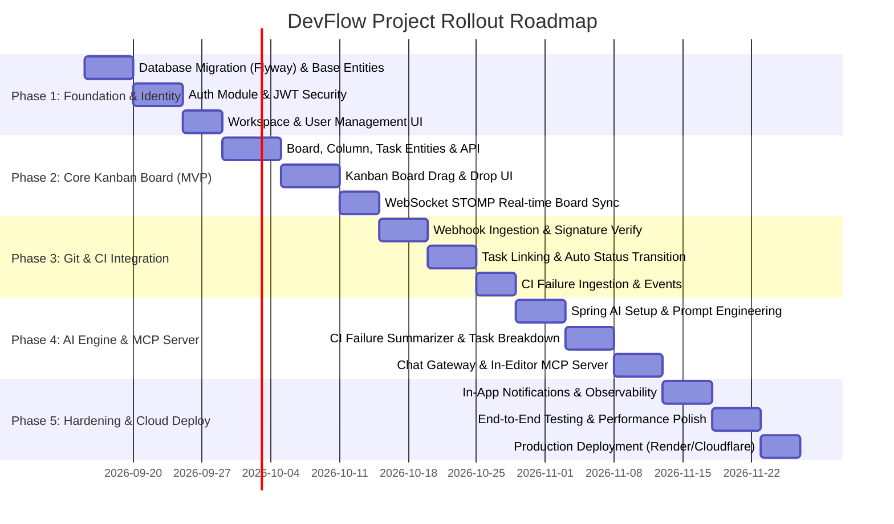

# DevFlow — Kế hoạch Triển khai Dự án Tổng quan (Master Implementation Plan)

> 🌐 **Ngôn ngữ:** **Tiếng Việt** (Dành cho Developer đọc & theo dõi) | [English Version (Best Practices for AI Agents)](file:///c:/Users/Tien/university/ServiceOrientedProgramDesign/DevFlow/docs/IMPLEMENTATION_PLAN.md)
>
> **Tài liệu Tham chiếu:**
> - Đặc tả sản phẩm: [docs/PRODUCT_SPEC_VI.md](file:///c:/Users/Tien/university/ServiceOrientedProgramDesign/DevFlow/docs/PRODUCT_SPEC_VI.md) | [PRODUCT_SPEC.md](file:///c:/Users/Tien/university/ServiceOrientedProgramDesign/DevFlow/docs/PRODUCT_SPEC.md)
> - Kiến trúc hệ thống: [docs/ARCHITECTURE_VI.md](file:///c:/Users/Tien/university/ServiceOrientedProgramDesign/DevFlow/docs/ARCHITECTURE_VI.md) | [ARCHITECTURE.md](file:///c:/Users/Tien/university/ServiceOrientedProgramDesign/DevFlow/docs/ARCHITECTURE.md)
> - Báo cáo Scaffold Audit: [AUDIT_REPORT.md](file:///c:/Users/Tien/university/ServiceOrientedProgramDesign/DevFlow/AUDIT_REPORT.md)
> - Bảng quản lý tiến độ: [Trello Development Board](https://trello.com/b/CKoJR2cC/development)
>
> **Thời gian dự kiến:** 1 Học kỳ (10–12 tuần)  
> **Quy mô nhóm:** 2 Thành viên  
> **Mục tiêu tối thượng:** Phát hành sản phẩm chạy thực tế (working software), triển khai lên môi trường Cloud, đáp ứng đầy đủ tiêu chí môn học Thiết kế chương trình hướng dịch vụ.

---

## 1. Tổng quan & Chiến lược Triển khai

DevFlow được xây dựng theo phong cách **Modular Monolith** trên nền Spring Boot 3.4.5 (Java 17) và React 19 (TypeScript, Vite, TailwindCSS v4). Để đảm bảo tiến độ và giảm thiểu rủi ro tích hợp, dự án áp dụng chiến lược **Phát triển Tăng dần theo Phân kỳ (Phased Incremental Delivery)**:

1. **Tuân thủ ranh giới module tuyệt đối (Zero-Tolerance Boundary Violation):** Mỗi module nghiệp vụ chỉ giao tiếp qua In-process Event Bus (`DevFlowEvent`) hoặc public API contract (`-api`).
2. **Ưu tiên MVP trước, Should-have sau:** Tập trung hoàn thiện luồng người dùng cốt lõi (Auth → Board → Git Integration → AI/MCP) trước khi mở rộng tính năng nâng cao.
3. **Mỗi Phase tương ứng một Sprint kiểm thử độc lập:** Mỗi tính năng đều có Migration, Unit/Integration Test và xác nhận qua `./gradlew check` và `npm run build`.

---

## 2. Chi tiết 5 Giai đoạn Triển khai (Phases Breakdown)

### 📌 Phase 1: Nền tảng Hệ thống & Xác thực (Foundation & Identity)
- **Mục tiêu:** Thay thế `ddl-auto: update` bằng Flyway migration chuẩn mực, hoàn thiện module `auth` và luồng xác thực đăng nhập người dùng cho cả Backend và Frontend.
- **Thời lượng dự kiến:** 2 tuần (Sprint 1)
- **Nghiệp vụ chi tiết:**
  1. **Database Migration:** Tích hợp `flyway-core` và `flyway-database-postgresql` vào `:backend:app`. Tạo migration script `V1__init_schema.sql` khởi tạo các bảng: `users`, `workspaces`, `workspace_members`.
  2. **Auth Backend (`auth-impl`):**
     - Thực thể JPA: `UserEntity`, `WorkspaceEntity`, `WorkspaceMemberEntity`.
     - Spring Security 6 + Stateless JWT: filter JWT, sinh token (access token + refresh token), mã hóa mật khẩu `BCryptPasswordEncoder`.
     - Endpoints RESTful:
       - `POST /api/v1/auth/register` (đăng ký)
       - `POST /api/v1/auth/login` (đăng nhập trả về JWT)
       - `GET /api/v1/auth/me` (thông tin user hiện tại)
       - `GET /api/v1/workspaces` & `POST /api/v1/workspaces` (danh sách và tạo workspace)
     - Triển khai `AuthApi` trong `auth-impl` cho các module khác tra cứu user/workspace.
  3. **Frontend Integration:**
     - Thiết lập HTTP Client (Axios instance) với Bearer Token interceptor và xử lý 401 tự động logout.
     - Xây dựng trang [LoginPage.tsx](file:///c:/Users/Tien/university/ServiceOrientedProgramDesign/DevFlow/frontend/src/pages/LoginPage.tsx) và `RegisterPage.tsx` với giao diện thẩm mỹ cao, validation form.
     - Quản lý trạng thái Auth (Context hoặc Zustand store) lưu giữ User profile & current workspace.
- **Tiêu chí nghiệm thu (DoD):**
  - [ ] Người dùng có thể đăng ký tài khoản, đăng nhập nhận JWT và tự động điều hướng vào Workspace.
  - [ ] DB migration chạy tự động không lỗi trên cả H2 (test) và PostgreSQL 17 (docker).
  - [ ] Unit tests cho `AuthService` và `JwtService` đạt coverage > 80%.

---

### 📌 Phase 2: Quản lý Bảng & Công việc Cốt lõi (Core Kanban Board - MVP)
- **Mục tiêu:** Xây dựng tính năng Kanban board hoàn chỉnh, hỗ trợ tương tác thẻ mượt mà và đồng bộ thời gian thực qua WebSocket.
- **Thời lượng dự kiến:** 2.5 tuần (Sprint 2)
- **Nghiệp vụ chi tiết:**
  1. **Database Migration:** Script `V2__board_schema.sql` tạo các bảng: `boards`, `columns`, `tasks`, `task_comments`, `task_tags`.
  2. **Board Backend (`board-impl`):**
     - Thực thể JPA: `BoardEntity`, `ColumnEntity`, `TaskEntity`, `CommentEntity`.
     - Logic nghiệp vụ:
       - CRUD Board theo Workspace.
       - Reorder Column (vị trí `position` trong board).
       - Thêm, sửa, xóa, gán assignee, đặt hạn (due date), priority (`LOW`, `MEDIUM`, `HIGH`, `URGENT`).
       - Kéo thả thẻ chuyển cột hoặc thay đổi thứ tự: cập nhật `column_id` và `position`.
     - Phát Domain Events:
       - `TaskCreatedEvent` khi tạo task mới.
       - `TaskStatusChangedEvent` khi thay đổi trạng thái/cột.
     - WebSocket STOMP Gateway: Broadcast bản tin thay đổi task tới `/topic/boards/{boardId}`.
     - Triển khai `BoardApi` (`findTasksByProject`, `findTask`).
  3. **Frontend Integration:**
     - Tái cấu trúc [BoardPage.tsx](file:///c:/Users/Tien/university/ServiceOrientedProgramDesign/DevFlow/frontend/src/pages/BoardPage.tsx): Hiển thị header board, thanh filter (search, priority, assignee).
     - Kanban UI: Các cột trạng thái (Backlog, To Do, In Progress, In Review, Done).
     - Tương tác kéo thả (Drag-and-Drop) mượt mà với hiệu ứng chuyển động tự nhiên.
     - Modal chi tiết Task: Cập nhật tiêu đề, mô tả Markdown, đổi trạng thái, bình luận.
     - Tích hợp hook WebSocket STOMP: Khi thành viên khác di chuyển thẻ, màn hình cập nhật ngay lập tức không cần F5.
- **Tiêu chí nghiệm thu (DoD):**
  - [ ] Kéo thả thẻ mượt mà trên UI, lưu đúng vị trí trong DB.
  - [ ] Mở 2 tab trình duyệt cùng xem 1 board, kéo thẻ ở tab 1 thì tab 2 lập tức nhảy theo thời gian thực.
  - [ ] Sự kiện `task.created` và `task.status_changed` được bắn lên Event Bus thành công.

---

### 📌 Phase 3: Tích hợp Git & Tự động hóa CI/CD (Git & CI Integration - MVP)
- **Mục tiêu:** Kết nối trực tiếp hoạt động lập trình thực tế (commits, PRs, pipeline fails) với trạng thái Kanban Board mà không cần thao tác tay.
- **Thời lượng dự kiến:** 2 tuần (Sprint 3)
- **Nghiệp vụ chi tiết:**
  1. **Database Migration:** Script `V3__gitci_schema.sql` tạo các bảng: `repositories`, `git_commits`, `pull_requests`, `ci_pipelines`, `ci_failures`.
  2. **Git & CI Backend (`gitci-impl`):**
     - Endpoint Webhook chung: `POST /api/v1/gitci/webhook/github` và `POST /api/v1/gitci/webhook/gitlab`.
     - Xác thực chữ ký webhook (HMAC SHA-256 Secret) để đảm bảo an toàn.
     - Bộ phân tích định dạng (Parser):
       - Trích xuất commit message, branch name tìm mã Task theo quy ước Regex: `(T-\d{3,4})` hoặc `(#T-\d{3,4})`.
     - Phát Domain Events:
       - Commit đẩy lên kèm Task ID → bắn `GitCommitLinkedEvent`.
       - PR mở kèm Task ID → bắn `GitPrOpenedEvent`.
       - PR được merge → bắn `GitPrMergedEvent`.
       - CI/CD build thất bại → lưu log lỗi, bắn `CiFailureDetectedEvent`.
  3. **Board Phản ứng tự động (`board-impl/GitActivityEventListener`):**
     - Nhận `GitCommitLinkedEvent`: Nếu task đang ở `To Do` → tự động chuyển sang `In Progress`.
     - Nhận `GitPrOpenedEvent`: Tự động chuyển task sang `In Review`.
     - Nhận `GitPrMergedEvent`: Tự động chuyển task sang `Done`.
  4. **Frontend Integration:**
     - Hiển thị Git metadata trên Card: Icon nhánh Git, số commit liên kết, link trực tiếp tới GitHub/GitLab PR.
     - Badge cảnh báo nếu CI/CD của commit liên quan đang bị đỏ (Failed).
- **Tiêu chí nghiệm thu (DoD):**
  - [ ] Giả lập gửi payload webhook GitHub push commit `feat(board): T-010 add drag drop` → Task `T-010` tự nhảy sang cột `In Progress`.
  - [ ] Merge PR trên GitHub → Task tự động di chuyển vào cột `Done`.
  - [ ] Log CI/CD fail được lưu trữ an toàn trong DB và kích hoạt event `ci.failure_detected`.

---

### 📌 Phase 4: Trợ lý AI & Cổng Giao tiếp MCP Server (AI Engine & MCP)
- **Mục tiêu:** Hiện thực hóa "bộ não" AI dùng chung giữa Web Chat và IDE lập trình viên (Cursor, Claude Code), tóm tắt lỗi CI/CD và phân rã yêu cầu.
- **Thời lượng dự kiến:** 2 tuần (Sprint 4)
- **Nghiệp vụ chi tiết:**
  1. **Tích hợp Spring AI (`ai-impl`):**
     - Cấu hình provider linh hoạt (OpenAI GPT-4o-mini hoặc OpenAI-compatible model, fallback mock khi không có API Key).
     - Kỹ thuật xây dựng Prompt (Prompt Engineering):
       - Context-aware System Prompt: Đưa thông tin danh sách task, tiến độ board vào prompt để trả lời chính xác.
  2. **Nghiệp vụ AI Cốt lõi:**
     - **Tóm tắt lỗi CI/CD (`summarizeCiFailure`):** Lắng nghe `CiFailureDetectedEvent`, phân tích nguyên nhân gốc (root cause) từ raw log (Stacktrace, NullPointerException, thiếu biến môi trường...), sinh tóm tắt ngắn gọn và phát `CiFailureSummarizedEvent`.
     - **Phân rã công việc (`proposeTaskBreakdown`):** Nhận văn bản mô tả tính năng/bug → bóc tách thành danh sách 3–5 subtasks kèm ước lượng sơ bộ.
     - **Hỏi đáp dự án (`answerProjectQuery`):** Trả lời các câu hỏi tự nhiên về trạng thái dự án ("Ai đang làm module auth?", "Còn bao nhiêu task chưa xong?").
     - **Cảnh báo trễ hạn (`risk.deadline_flagged`):** Phân tích các task gần due date mà chưa vào `In Review`/`Done` để phát cảnh báo.
  3. **Chat WebSocket Gateway (`ChatGatewayController`):**
     - Luồng chat hai chiều: Web client gửi câu hỏi tới `/app/chat` → nhận câu trả lời dạng stream/text tại `/topic/chat`.
     - Cho phép user bấm "Xác nhận tạo các task này" ngay trên kết quả AI phân rã để tự động add vào Board.
  4. **MCP Server Integration (Model Context Protocol):**
     - Khai báo MCP Tools qua `@Tool`:
       - `queryProject(projectId, question)`: Tra cứu tiến độ dự án từ IDE.
       - `lookupCiFailure(pipelineId)`: Xem phân tích nguyên nhân lỗi CI/CD ngay trong file code.
       - `getMyTasks(username)`: Cho developer biết họ cần làm gì tiếp theo.
  5. **Frontend AI Chat UI:**
     - Hoàn thiện [ChatPanel.tsx](file:///c:/Users/Tien/university/ServiceOrientedProgramDesign/DevFlow/frontend/src/components/ChatPanel.tsx) ở góc phải: Giao diện chat hiện đại, hỗ trợ render Markdown, code snippet, và các Action Card (nút "Tạo Task" từ gợi ý của AI).
- **Tiêu chí nghiệm thu (DoD):**
  - [ ] Khi CI fail, thẻ Task liên quan hiển thị bản tóm tắt nguyên nhân lỗi súc tích do AI phân tích.
  - [ ] Người dùng chat "Chia nhỏ tính năng upload avatar" → AI trả về danh sách subtasks hợp lý kèm nút bấm tạo thẻ lên Board.
  - [ ] Cấu hình MCP Server vào Cursor/Claude Code thử nghiệm gọi tool thành công.

---

### 📌 Phase 5: Thông báo, Tối ưu & Triển khai Đám mây (Hardening & Cloud Deploy)
- **Mục tiêu:** Hoàn thiện trải nghiệm thông báo, giám sát hiệu năng với Prometheus/Grafana, kiểm thử toàn diện và deploy sản phẩm lên Cloud phục vụ nghiệm thu.
- **Thời lượng dự kiến:** 1.5 tuần (Sprint 5)
- **Nghiệp vụ chi tiết:**
  1. **Notification Module (`notification-impl`):**
     - Xử lý các sự kiện `TaskCreatedEvent`, `TaskStatusChangedEvent`, `CiFailureSummarizedEvent`, `RiskDeadlineFlaggedEvent`.
     - Lưu trữ thông báo trong bảng `notifications`.
     - Đẩy thông báo real-time qua WebSocket `/topic/notifications/{userId}` hoặc SSE.
     - Frontend Notification Center: Dropdown chuông thông báo, badge đếm tin chưa đọc, đánh dấu đã đọc.
  2. **Kiểm thử Toàn diện & Rà soát Kiến trúc:**
     - Chạy `./gradlew :verifyModuleBoundaries` bảo đảm không có vi phạm ranh giới module.
     - Kiểm thử tích hợp (Integration Tests) với Database PostgreSQL thật qua Testcontainers hoặc Docker Compose.
     - Kiểm thử tải cơ bản (JMeter/k6) cho endpoint Kanban board và WebSocket.
  3. **Giám sát & Đo lường (Observability):**
     - Dashboard Grafana trực quan: CPU/Memory JVM, HikariCP Connection Pool, Response Time P95, Số lượng Domain Events đã phát.
  4. **Triển khai Môi trường Thực tế (Production Deployment):**
     - **Backend & Database:** Deploy container Spring Boot và PostgreSQL lên PaaS (Render, Railway hoặc Fly.io).
     - **Frontend:** Build tối ưu tĩnh và deploy lên Cloudflare Pages (hoặc Vercel) với Custom Domain & SSL miễn phí.
     - Kiểm tra toàn bộ luồng E2E trên domain công khai: Đăng ký → Tạo Board → Nhận Webhook Git → Hỏi đáp AI.
- **Tiêu chí nghiệm thu (DoD):**
  - [ ] Hệ thống hoạt động trực tiếp trên Internet với HTTPS hợp lệ.
  - [ ] Grafana hiển thị đầy đủ metrics của hệ thống đang chạy.
  - [ ] Bộ tài liệu báo cáo kỹ thuật và video demo kịch bản hoàn tất.

---

## 3. Ma trận Phân công & Lộ trình Sprint (Sprint Mapping)

| Sprint | Thời gian | Trọng tâm | Deliverables chính | Người phụ trách chính |
|---|---|---|---|---|
| **Sprint 1** | Tuần 1–2 | Foundation & Auth | Flyway V1, Spring Security JWT, Login/Register UI | Member A (Backend) & Member B (Frontend) |
| **Sprint 2** | Tuần 3–5 | Board & Real-time | Board/Task CRUD, Drag-and-Drop, WebSocket Sync | Member A (Board Engine) & Member B (Kanban UI) |
| **Sprint 3** | Tuần 6–7 | Git & CI Automation | Webhook Parser, Auto-move cards, CI log ingest | Member A (Webhook & Events) & Member B (Git Badges) |
| **Sprint 4** | Tuần 8–9 | AI & MCP Engine | Spring AI, CI Summarizer, Chat UI, MCP Server | Member A (Spring AI/MCP) & Member B (Chat Drawer) |
| **Sprint 5** | Tuần 10–11 | Hardening & Deploy | In-app Alerts, Prometheus/Grafana, Cloud Release | Cả 2 thành viên |

---

## 4. Danh mục Ticket Chuẩn bị Đưa lên Trello (Backlog Initial Seeds)

Dưới đây là danh sách các thẻ mẫu sẵn sàng chuyển thành ticket chính thức trên Trello (đặt mã `T-XXX`):

### Phase 1 Tickets
- `T-000`: Thiết kế Kiến trúc CSDL, Sơ đồ ERD & Ranh giới Dữ liệu Liên Module (`docs/DATABASE_DESIGN_VI.md`)
- `T-001`: Thiết lập Flyway Migration & Base Schema (`V1__init_schema.sql`)
- `T-002`: Hiện thực Entity User & Workspace kèm Spring Data JPA Repositories
- `T-003`: Xây dựng Stateless JWT Authentication & Security Filter Chain
- `T-004`: Hiện thực Auth REST API (`/login`, `/register`, `/me`, `/workspaces`)
- `T-005`: Xây dựng Axios Client, Auth Interceptor & Auth Context trên Frontend
- `T-006`: Thiết kế giao diện Đăng ký, Đăng nhập & Chọn Workspace

### Phase 2 Tickets
- `T-010`: Thiết lập Flyway Migration cho Board Schema (`V2__board_schema.sql`)
- `T-011`: Hiện thực Entities & Repositories cho Board, Column, Task, Comment
- `T-012`: Xây dựng REST API cho Board & Column CRUD kèm phân quyền Workspace
- `T-013`: Xây dựng REST API cho Task CRUD & Di chuyển thẻ (Reorder / Move column)
- `T-014`: Hiện thực Event Publisher cho `TaskCreatedEvent` & `TaskStatusChangedEvent`
- `T-015`: Cấu hình WebSocket STOMP Broadcaster cho Board state updates
- `T-016`: Tái cấu trúc Giao diện BoardPage & Xây dựng Kanban Drag-and-Drop
- `T-017`: Xây dựng Task Detail Modal (Markdown description, Assignee, Due date)
- `T-018`: Tích hợp Frontend WebSocket Client đồng bộ chuyển động thẻ real-time

### Phase 3 Tickets
- `T-020`: Thiết lập Flyway Migration cho Git & CI Schema (`V3__gitci_schema.sql`)
- `T-021`: Xây dựng Webhook Ingestion Controller & HMAC SHA-256 Signature Validator
- `T-022`: Xây dựng Bộ Parser tách Task ID từ Git Commits & Branch Names
- `T-023`: Hiện thực phát Domain Events (`git.commit_linked`, `git.pr_opened`, `git.pr_merged`)
- `T-024`: Xây dựng `GitActivityEventListener` tự động cập nhật cột Task trên Board
- `T-025`: Xây dựng CI Failure Webhook Receiver & phát `CiFailureDetectedEvent`
- `T-026`: Hiển thị Git & CI Status Badges trên Card giao diện Frontend

### Phase 4 Tickets
- `T-030`: Tích hợp Spring AI Starter & Cấu hình ChatClient (OpenAI / Fallback Mock)
- `T-031`: Xây dựng Service tóm tắt log CI/CD & phát `CiFailureSummarizedEvent`
- `T-032`: Xây dựng Service phân rã Task từ văn bản mô tả (`proposeTaskBreakdown`)
- `T-033`: Xây dựng Service hỏi đáp dự án theo ngôn ngữ tự nhiên (`answerProjectQuery`)
- `T-034`: Hiện thực STOMP ChatGatewayController cho giao tiếp chat thời gian thực
- `T-035`: Thiết lập Spring AI MCP Server WebMVC adapter với các `@Tool` functions
- `T-036`: Hoàn thiện ChatPanel UI trên Frontend hỗ trợ Markdown & 1-Click Task Creation

### Phase 5 Tickets
- `T-040`: Hiện thực Notification Service & In-app Notification Dropdown
- `T-041`: Viết bộ Integration Tests kiểm thử liên module qua Event Bus
- `T-042`: Hoàn thiện Dashboard Grafana giám sát hiệu năng hệ thống
- `T-043`: Cấu hình Docker Production Multi-stage & Deploy lên PaaS (Render / Railway)
- `T-044`: Deploy Frontend lên Cloudflare Pages & Cấu hình Reverse Proxy / Domain
- `T-045`: Soạn thảo Báo cáo Nghiệm thu Kỹ thuật & Video Demo Dự án

---

## 5. Tiêu chuẩn Định nghĩa Hoàn thành (Definition of Done - DoD)

Một ticket chỉ được coi là hoàn thành (chuyển sang cột `Done` trên Trello) khi thỏa mãn:

1. **Tuân thủ Kiến trúc:** `./gradlew :verifyModuleBoundaries` chạy qua với 0 cảnh báo vi phạm. Không có dependency chéo giữa các package `-impl`.
2. **Kiểm thử Tự động:** Các phương thức nghiệp vụ mới có Unit Test; các luồng API chính có Integration Test. Toàn bộ test suite `./gradlew check` chạy thành công.
3. **Frontend Compile & Lint:** `npm run build` không có lỗi TypeScript (`tsc -b`), `npm run lint` vượt qua 0 lỗi.
4. **Clean Code & Format:** Tuân thủ hướng dẫn tại `.agents/rules/coding-conventions.md`.
5. **Git Workflow:** Tạo branch theo cú pháp `feature/T-XXX-...`, commit theo chuẩn Conventional Commits, PR được review và squash-merge vào `develop`.
