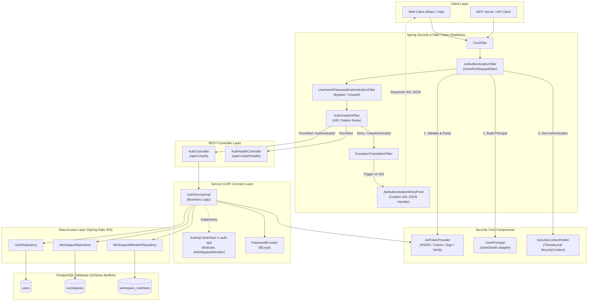
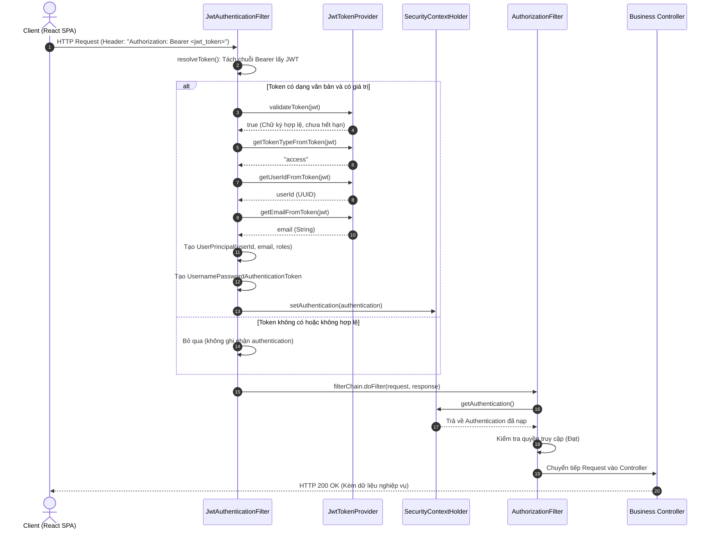
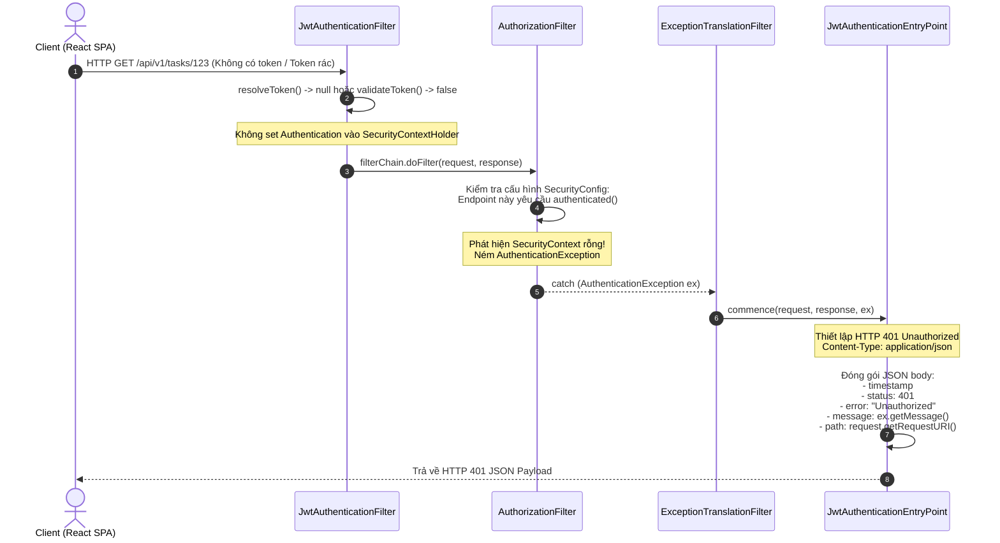
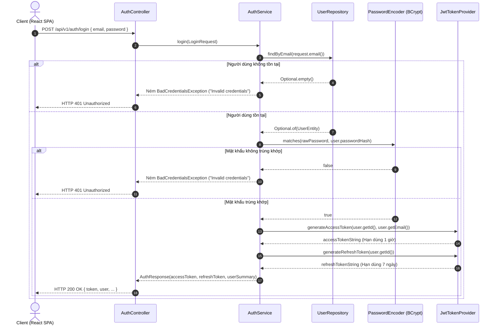
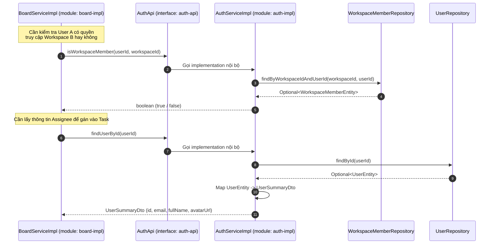

# DevFlow — Kiến trúc Chi tiết Module Auth & Các Luồng Xử lý

> 🌐 **Tài liệu đặc tả kiến trúc thành phần và các luồng tương tác bảo mật của module `auth`**  
> Phiên bản: 1.0 (Tương ứng với các ticket `T-000` đến `T-004`)  
> Phạm vi: `backend/auth-api` và `backend/auth-impl`

---

## 1. Sơ đồ Kiến trúc Thành phần (Component Architecture)

Module `auth` chịu trách nhiệm quản lý danh tính người dùng (Users), không gian làm việc (Workspaces), quyền thành viên (Workspace Members) và cung cấp cơ chế bảo mật xác thực phi trạng thái (Stateless JWT) cho toàn bộ ứng dụng DevFlow.

---

## 2. Luồng Xử lý 1: Request Hợp lệ Gửi Kèm JWT Token

Áp dụng cho mọi API được bảo vệ (ví dụ: `GET /api/v1/boards`, `GET /api/v1/auth/me`).

---

## 3. Luồng Xử lý 2: Request Bị Từ Chối Xác Thực (Xử lý HTTP 401)

Khi Client không gửi token, token hết hạn, hoặc chữ ký token không đúng khi truy cập vào một tài nguyên yêu cầu xác thực (`.anyRequest().authenticated()`).

---

## 4. Luồng Xử lý 3: Đăng nhập Người dùng (`POST /api/v1/auth/login`)

---

## 5. Luồng Xử lý 4: Giao tiếp Liên Module qua Interface `AuthApi`

Các module khác (như `board-impl`, `git-impl`) không được phép gọi trực tiếp JPA Entity hay Repo của Auth mà phải đi qua interface `AuthApi` nằm trong `auth-api`.

---

## 6. Bảng Ánh xạ Thành phần Mã Nguồn (Code Mapping)

| Thành phần | Đường dẫn mã nguồn | Vai trò / Trách nhiệm chính |
|---|---|---|
| **Security Configuration** | [SecurityConfig.java](file:///c:/Users/Tien/university/ServiceOrientedProgramDesign/DevFlow/backend/auth-impl/src/main/java/io/devflow/auth/internal/SecurityConfig.java) | Định nghĩa `SecurityFilterChain`, các URL `permitAll()` vs `authenticated()`, đăng ký Filter và Exception EntryPoint. |
| **Authentication Filter** | [JwtAuthenticationFilter.java](file:///c:/Users/Tien/university/ServiceOrientedProgramDesign/DevFlow/backend/auth-impl/src/main/java/io/devflow/auth/internal/security/JwtAuthenticationFilter.java) | Bóc tách Bearer token, gọi validator, tạo `UserPrincipal` và nạp vào `SecurityContextHolder`. |
| **Token Provider** | [JwtTokenProvider.java](file:///c:/Users/Tien/university/ServiceOrientedProgramDesign/DevFlow/backend/auth-impl/src/main/java/io/devflow/auth/internal/security/JwtTokenProvider.java) | Ký token HMAC SHA-256, parse claims, kiểm tra hạn dùng và loại token (`access`/`refresh`). |
| **Authentication Entry Point** | [JwtAuthenticationEntryPoint.java](file:///c:/Users/Tien/university/ServiceOrientedProgramDesign/DevFlow/backend/auth-impl/src/main/java/io/devflow/auth/internal/security/JwtAuthenticationEntryPoint.java) | Bắt ngoại lệ xác thực và định dạng phản hồi JSON chuẩn 401 Unauthorized. |
| **Principal Model** | [UserPrincipal.java](file:///c:/Users/Tien/university/ServiceOrientedProgramDesign/DevFlow/backend/auth-impl/src/main/java/io/devflow/auth/internal/security/UserPrincipal.java) | Implement `UserDetails`, đại diện cho danh tính đang hoạt động của thread request hiện tại. |
| **REST Controller** | [AuthController.java](file:///c:/Users/Tien/university/ServiceOrientedProgramDesign/DevFlow/backend/auth-impl/src/main/java/io/devflow/auth/internal/AuthController.java) | Cung cấp endpoints công khai cho việc Login, Register, Refresh Token, và Me. |
| **Service Layer** | [AuthService.java](file:///c:/Users/Tien/university/ServiceOrientedProgramDesign/DevFlow/backend/auth-impl/src/main/java/io/devflow/auth/internal/AuthService.java) | Triển khai logic nghiệp vụ tài khoản và giao diện `AuthApi` liên module. |
| **JPA Entities** | `entity/UserEntity.java`, `WorkspaceEntity.java`, `WorkspaceMemberEntity.java` | Quản lý cấu trúc dữ liệu bảng tương ứng theo schema `V1__init_schema.sql`. |
