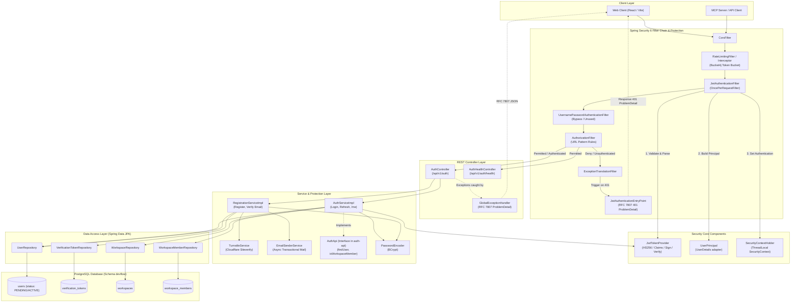
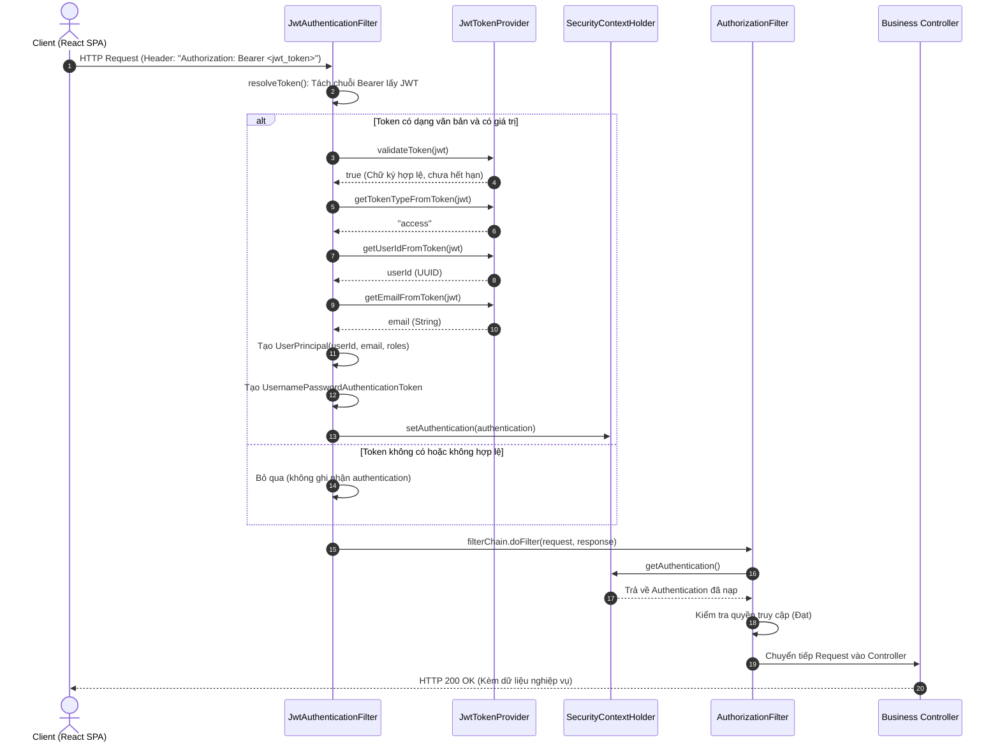
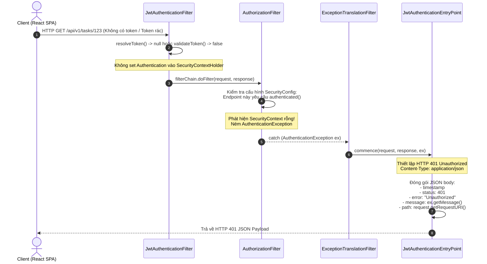
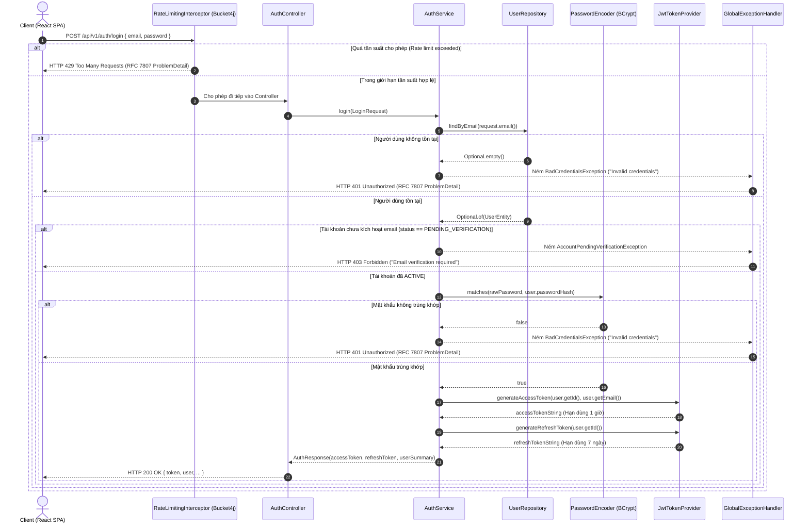
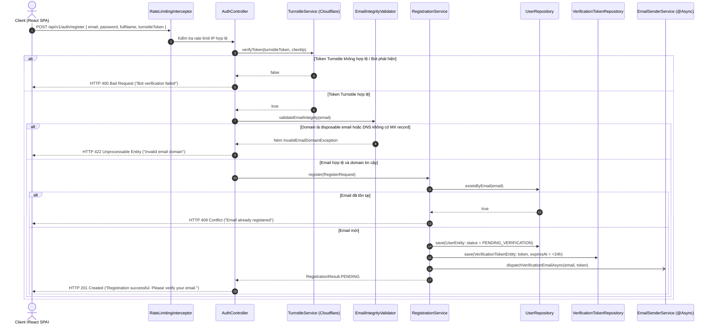
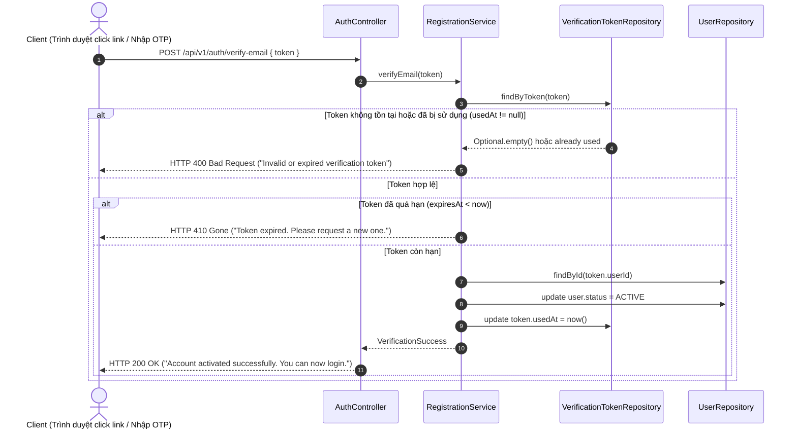
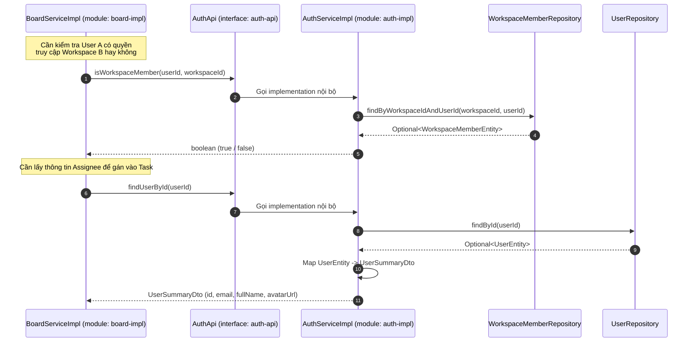

# DevFlow — Kiến trúc Chi tiết Module Auth & Các Luồng Xử lý

> 🌐 **Tài liệu đặc tả kiến trúc thành phần và các luồng tương tác bảo mật của module `auth`**  
> Phiên bản: 1.1 (Cập nhật chuẩn Production SaaS: Phân tách các ticket `T-004`, `T-004A`, `T-004B`)  
> Phạm vi: `backend/auth-api` và `backend/auth-impl`

---

## 1. Sơ đồ Kiến trúc Thành phần (Component Architecture)

Module `auth` chịu trách nhiệm quản lý danh tính người dùng (Users), không gian làm việc (Workspaces), quyền thành viên (Workspace Members), quy trình xác thực email (Verification Tokens), cơ chế phòng chống bot (Turnstile) và cung cấp cơ chế bảo mật xác thực phi trạng thái (Stateless JWT) cho toàn bộ ứng dụng DevFlow.

---

## 2. Luồng Xử lý 1: Request Hợp lệ Gửi Kèm JWT Token

Áp dụng cho mọi API được bảo vệ (ví dụ: `GET /api/v1/boards`, `GET /api/v1/auth/me`).

---

## 3. Luồng Xử lý 2: Request Bị Từ Chối Xác Thực (Xử lý HTTP 401)

Khi Client không gửi token, token hết hạn, hoặc chữ ký token không đúng khi truy cập vào một tài nguyên yêu cầu xác thực (`.anyRequest().authenticated()`).

---

## 4. Luồng Xử lý 3: Đăng nhập Người dùng (`POST /api/v1/auth/login` - Ticket `T-004`)

Luồng đăng nhập được bảo vệ bởi bộ đệm giới hạn tần suất (Rate Limiter) và bắt buộc tài khoản phải ở trạng thái `ACTIVE` (đã qua bước xác thực email).

---

## 5. Luồng Xử lý 4: Đăng ký Tài khoản, Chống Bot & Gửi Mail Xác thực (`T-004A` & `T-004B`)

Đảm bảo ngăn chặn bot tự động đăng ký, lọc email dùng một lần và kích hoạt quy trình gửi email xác thực bất đồng bộ.

---

## 6. Luồng Xử lý 5: Kích hoạt Tài khoản qua Email (`POST /api/v1/auth/verify-email` - `T-004A`)

Xác nhận mã/token xác thực được gửi qua email để nâng cấp tài khoản sang trạng thái `ACTIVE`.

---

## 7. Luồng Xử lý 6: Giao tiếp Liên Module qua Interface `AuthApi`

Các module khác (như `board-impl`, `git-impl`) không được phép gọi trực tiếp JPA Entity hay Repo của Auth mà phải đi qua interface `AuthApi` nằm trong `auth-api`.

---

## 8. Bảng Ánh xạ Thành phần Mã Nguồn (Code Mapping)

| Thành phần | Đường dẫn mã nguồn | Ticket | Vai trò / Trách nhiệm chính |
|---|---|---|---|
| **Security Configuration** | [SecurityConfig.java](file:///c:/Users/Tien/university/ServiceOrientedProgramDesign/DevFlow/backend/auth-impl/src/main/java/io/devflow/auth/internal/SecurityConfig.java) | `T-003` | Định nghĩa `SecurityFilterChain`, các URL `permitAll()` vs `authenticated()`, đăng ký Filter. |
| **Authentication Filter** | [JwtAuthenticationFilter.java](file:///c:/Users/Tien/university/ServiceOrientedProgramDesign/DevFlow/backend/auth-impl/src/main/java/io/devflow/auth/internal/security/JwtAuthenticationFilter.java) | `T-003` | Bóc tách Bearer token, gọi validator, tạo `UserPrincipal` và nạp vào `SecurityContextHolder`. |
| **Token Provider** | [JwtTokenProvider.java](file:///c:/Users/Tien/university/ServiceOrientedProgramDesign/DevFlow/backend/auth-impl/src/main/java/io/devflow/auth/internal/security/JwtTokenProvider.java) | `T-003` | Ký token HMAC SHA-256, parse claims, kiểm tra hạn dùng access/refresh token. |
| **Exception Handler & EntryPoint** | `JwtAuthenticationEntryPoint.java`, `GlobalExceptionHandler.java` | `T-004` | Xử lý lỗi toàn cục và định dạng phản hồi chuẩn RFC 7807 `ProblemDetail`, giấu stack trace. |
| **Rate Limiter Interceptor** | `RateLimitingInterceptor.java` | `T-004` | Giới hạn tần suất gọi API công khai bằng thuật toán Token Bucket (Bucket4j). |
| **REST Controller** | [AuthController.java](file:///c:/Users/Tien/university/ServiceOrientedProgramDesign/DevFlow/backend/auth-impl/src/main/java/io/devflow/auth/internal/AuthController.java) | `T-004`, `T-004A` | Endpoints cho Login, Refresh, Me, Workspaces, Register, Verify Email. |
| **Core Auth Service** | [AuthService.java](file:///c:/Users/Tien/university/ServiceOrientedProgramDesign/DevFlow/backend/auth-impl/src/main/java/io/devflow/auth/internal/AuthService.java) | `T-004` | Xử lý đăng nhập, cấp token JWT, kiểm tra trạng thái active và cài đặt `AuthApi`. |
| **Registration & Email Service** | `RegistrationService.java`, `EmailSenderService.java` | `T-004A` | Xử lý tạo user `PENDING`, sinh verification token, gửi email xác thực bất đồng bộ và kích hoạt. |
| **Anti-Abuse & Bot Service** | `TurnstileService.java`, `DisposableEmailValidator.java` | `T-004B` | Kiểm tra token Cloudflare Turnstile, lọc disposable email, kiểm tra bản ghi DNS MX. |
| **JPA Entities & Repositories** | `entity/UserEntity.java`, `VerificationTokenEntity.java`, `WorkspaceEntity.java` | `T-002`, `T-004A` | Quản lý dữ liệu bảng `users` (thêm `status`), `verification_tokens`, `workspaces`, `workspace_members`. |

